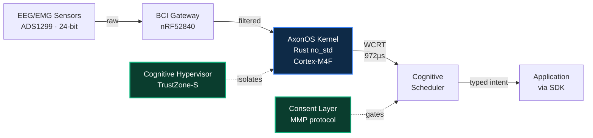

<div align="center">


<br/>
<br/>

# **axonos**

### The open cognitive operating system for brain-computer interfaces.

<br/>

[](./README.md)
[](./README.ja.md)
[](./README.zh.md)
[](./README.it.md)
[](./README.fr.md)
[](./README.de.md)
[](./README.es.md)
[](./README.ar.md)

<br/>

[](https://github.com/AxonOS-org/axonos-sdk)
[](https://github.com/AxonOS-org/AxonOS-kernel)
[](https://axonos.org/specifications.html)
[](https://www.rust-lang.org/)
[](#licensing)
[](https://model-checking.github.io/kani/)

### [🌐 axonos.org](https://axonos.org) · [📐 Specifications](https://axonos.org/specifications.html) · [🧰 SDK](https://axonos.org/sdk.html) · [📖 Articles](https://medium.com/@AxonOS) · [💬 connect@axonos.org](mailto:connect@axonos.org)

</div>

---

## Project AxonOS

<br/>

**AxonOS is a hard real-time neural operating system for brain-computer interfaces.** Open-source kernel in `#![no_std]` Rust. Sub-millisecond jitter on commodity ARM Cortex-M. Formally bounded worst-case response time. Structural privacy that the application layer cannot bypass.

Built for the patients who depend on closed-loop assistive interfaces, and for the engineers who refuse to ship them on best-effort scheduling.

<br/>

## Why this exists

Every BCI application today re-parses a bespoke binary wire format per device, re-implements capability gating, and re-writes integration boilerplate for every new hardware platform.

**AxonOS does all three once, in safe `no_std` Rust, on top of a formally-bounded microkernel.** One verifiable substrate. One typed API surface. Many hardware backends.

<br/>

## The four commitments

<br/>

|     | Commitment                       | What it means in practice                                                                                                          |
|:---:|:---------------------------------|:-----------------------------------------------------------------------------------------------------------------------------------|
| 🦀  | **Hard real-time on commodity hardware** | `#![no_std]` Rust on ARMv8-M. No GC, no allocator on the hot path, no unbounded panics. Memory safety is structural.        |
| 📐  | **Formally bounded WCRT**       | Every critical-path operation has a Kani-verified upper bound. Latency is *proven*, not benchmarked.                              |
| 🔒  | **Structural privacy**          | Capabilities that would leak raw cognitive state (`RawEEG`, `EmotionState`, `CognitiveProfile`) do not exist as types.            |
| 🌐  | **Open ecosystem**              | Apache-2.0 OR MIT for code, CC-BY-SA-4.0 for specifications. Every repository is public. Anyone can audit, fork, or replace any layer. |

<br/>

## Quick start

Sixty seconds from clone to your first intent observation.

```sh
git clone https://github.com/AxonOS-org/axonos-sdk
cd axonos-sdk
cargo test --features std
```

```rust
use axonos_sdk::{Capability, IntentStream, Manifest};

let manifest = Manifest::builder()
    .app_id("com.example.cursor")?
    .capability(Capability::Navigation)
    .max_rate_hz(50)
    .build()?;

let mut stream = IntentStream::connect(&manifest)?;
while let Some(obs) = stream.try_next()? {
    println!("{:?} @ {} µs ({}%)",
        obs.kind(),
        obs.timestamp().as_micros(),
        obs.confidence_percent());
}
```

The SDK is the Rust reference binding. C FFI, Python, WebAssembly, JNI, and Swift bindings are on the [published roadmap](https://axonos.org/sdk.html).

<br/>

## The repositories

All six repositories are public. Source under Apache-2.0 OR MIT. Specifications under CC-BY-SA-4.0.

|                                                                              | Repository           | Purpose                                                                            | Language | Latest     |
|:----------------------------------------------------------------------------:|:---------------------|:-----------------------------------------------------------------------------------|:--------:|:-----------|
| [⬢](https://github.com/AxonOS-org/AxonOS-kernel)                              | **AxonOS-kernel**    | Hard real-time microkernel — 8 crates, formally bounded WCRT, 28 Kani harnesses    | Rust     | `v0.2.1`   |
| [⬢](https://github.com/AxonOS-org/axonos-sdk)                                 | **axonos-sdk**       | Application boundary — typed intents, capability manifests, kernel ABI v1          | Rust     | `v0.3.4`   |
| [⬢](https://github.com/AxonOS-org/axonos-consent)                             | **axonos-consent**   | Protocol-level consent enforcement for cognitive mesh coupling (MMP)               | Rust     | `v0.4.0`   |
| [⬢](https://github.com/AxonOS-org/axonos-swarm)                               | **axonos-swarm**     | Multi-node coordination — Neural PTP synchronisation, swarm scheduling             | Rust     | `v0.2.0`   |
| [⬢](https://github.com/AxonOS-org/axonos-rfcs)                                | **axonos-rfcs**      | Engineering specifications — 8 numbered RFCs, normative, CC-BY-SA-4.0              | Markdown | active     |
| [⬢](https://github.com/AxonOS-org/axon-bci-gateway)                           | **axon-bci-gateway** | Hardware acquisition gateway (OpenBCI fork, MIT preserved from upstream)           | HTML     | active     |

<br/>

## Architecture

<br/>



<br/>

## By the numbers

<br/>

<table align="center">
<tr>
  <td align="center" width="200">
    <h2>972 µs</h2>
    <sub>Kernel WCRT, measured<br/>STM32F407 @ 168 MHz</sub>
  </td>
  <td align="center" width="200">
    <h2>2.1 µs</h2>
    <sub>Worst-case jitter σ<br/>vs Linux 1323 µs</sub>
  </td>
  <td align="center" width="200">
    <h2>630×</h2>
    <sub>Improvement factor<br/>over Linux mainline</sub>
  </td>
</tr>
<tr>
  <td align="center">
    <h2>28</h2>
    <sub>Kani BMC harnesses<br/>upper bounds proven</sub>
  </td>
  <td align="center">
    <h2>66+</h2>
    <sub>Unit and integration<br/>tests across the workspace</sub>
  </td>
  <td align="center">
    <h2>42+</h2>
    <sub>Long-form architecture<br/>articles on Medium</sub>
  </td>
</tr>
</table>

<br/>

## Status

<br/>

| Phase        | What                                                                                       | When        |
|:-------------|:-------------------------------------------------------------------------------------------|:------------|
| **Phase 0**  | Architecture, RFCs, SDK API surface, kernel verification harnesses                          | ✓ Complete  |
| **Phase 1**  | Clinical-grade 8-channel development kit · ALS centre clinical pilot                       | 🟡 Q2 2026  |
| **Phase 2**  | FDA 510(k) Q-Sub for Cognitive Hypervisor · IEEE P2731 contribution                        | 🔵 Q3 2026  |
| **Phase 3**  | First commercial deployment via Foundation members                                          | 🔵 2027     |

<br/>

## Documentation

- [**Specifications**](https://axonos.org/specifications.html) — kernel ABI v1, capability catalogue, `IntentObservation` wire format, RFC index
- [**SDK and language bindings**](https://axonos.org/sdk.html) — Rust today; C FFI, Python, WebAssembly, JNI, Swift on the published roadmap
- [**Standards engagement**](https://axonos.org/standards.html) — IEEE P2731 · IEC 62304 · ISO 13485 · FDA 510(k) · EU MDR
- [**Governance**](https://axonos.org/governance.html) — current state, transition plan, trademark policy
- [**Long-form articles**](https://medium.com/@AxonOS) — 42+ pieces, one per major architectural decision
- [**Engineering memo**](https://axonos.org/memo.html) — three-page summary for technical readers

<br/>

## Contributing

| Path                         | Where                                                                                |
|:-----------------------------|:--------------------------------------------------------------------------------------|
| Bugs and feature requests    | the relevant repository's Issues tab                                                  |
| Specification proposals      | pull request to [axonos-rfcs](https://github.com/AxonOS-org/axonos-rfcs)              |
| Code contributions           | [axonos-sdk CONTRIBUTING.md](https://github.com/AxonOS-org/axonos-sdk/blob/main/CONTRIBUTING.md) |
| Security disclosures         | [security@axonos.org](mailto:security@axonos.org) · 90-day coordinated disclosure     |
| Clinical partnerships        | [connect@axonos.org](mailto:connect@axonos.org)                                       |
| Press, speaking, general     | [info@axonos.org](mailto:info@axonos.org)                                             |

<br/>

## Licensing

| Artifact                              | License                                            |
|:--------------------------------------|:---------------------------------------------------|
| Kernel, SDK, consent, swarm, gateway  | Apache-2.0 OR MIT                                  |
| RFCs and specifications               | CC-BY-SA-4.0                                       |
| `axon-bci-gateway`                    | MIT (preserved from upstream OpenBCI_GUI)          |

<br/>
<br/>

---

<div align="center">


<br/>
<br/>

**Built and maintained by Denis Yermakou**

[denis@axonos.org](mailto:denis@axonos.org) · [LinkedIn](https://www.linkedin.com/in/denis-yermakou) · [Medium](https://medium.com/@AxonOS) · [Site](https://axonos.org)

<sub>Singapore · Zurich · Berlin · Milano · San Mateo</sub>

<br/>

<sub>Built with Rust. Verified with Kani. Aimed at hard real-time.</sub>

<sub><i>The kernel is how we earn the right to see real brain signals.</i></sub>

</div>
