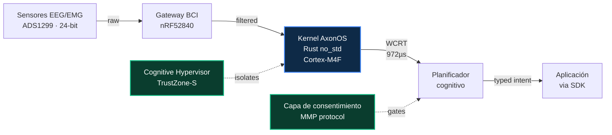

<div align="center">


<br/>
<br/>

# **axonos**

### El sistema operativo cognitivo abierto para las interfaces cerebro-computadora.

<br/>

[](./README.md)
[](./README.ja.md)
[](./README.zh.md)
[](./README.it.md)
[](./README.fr.md)
[](./README.de.md)
[](./README.es.md)
[](./README.ar.md)

<br/>

[](https://github.com/AxonOS-org/axonos-sdk)
[](https://github.com/AxonOS-org/axonos-kernel)
[](https://axonos.org/specifications.html)
[](https://www.rust-lang.org/)
[](#licensing)

### [🌐 axonos.org](https://axonos.org) · [📐 Especificaciones](https://axonos.org/specifications.html) · [🧰 SDK](https://axonos.org/sdk.html) · [📖 Artículos](https://medium.com/@AxonOS) · [💬 connect@axonos.org](mailto:connect@axonos.org)

</div>

---

## Proyecto AxonOS

<br/>

**AxonOS es un sistema operativo neuronal de tiempo real estricto para interfaces cerebro-computadora.** Kernel de código abierto en `#![no_std]` Rust. Jitter sub-milisegundo en ARM Cortex-M comercial. Tiempo de respuesta en el peor caso formalmente acotado. Privacidad estructural que la capa de aplicación no puede eludir.

Construido para los pacientes que dependen de interfaces asistivas de bucle cerrado, y para los ingenieros que se niegan a entregarlos sobre planificación best-effort.

<br/>

## Por qué existe AxonOS

Hoy, cada aplicación BCI debe reparsear un formato binario propio por dispositivo, reimplementar el control de capacidades, y reescribir el código de integración para cada nueva plataforma de hardware.

**AxonOS hace las tres cosas una sola vez, en `no_std` Rust seguro, sobre un microkernel formalmente acotado.** Una base verificable. Una superficie API tipada. Múltiples backends de hardware.

<br/>

## Los cuatro compromisos

<br/>

|     | Compromiso                    | Lo que significa en la práctica                                                                                                    |
|:---:|:------------------------------|:-----------------------------------------------------------------------------------------------------------------------------------|
| 🦀  | **Tiempo real estricto en hardware comercial** | Rust `#![no_std]` en ARMv8-M. Sin GC, sin asignador en el camino caliente, sin panics no acotados.                |
| 📐  | **WCRT formalmente acotado**  | Cada operación crítica tiene un límite superior verificado por Kani. La latencia se *demuestra*, no se mide.                     |
| 🔒  | **Privacidad estructural**    | Las capacidades que filtrarían estado cognitivo crudo (`RawEEG`, `EmotionState`, `CognitiveProfile`) no existen como tipos.       |
| 🌐  | **Ecosistema abierto**        | Apache-2.0 OR MIT para código, CC-BY-SA-4.0 para especificaciones. Todos los repositorios son públicos. Cualquiera puede auditar, bifurcar o reemplazar cualquier capa. |

<br/>

## Inicio rápido

Sesenta segundos desde el clone hasta tu primera observación de intención.

```sh
git clone https://github.com/AxonOS-org/axonos-sdk
cd axonos-sdk
cargo test --features std
```

```rust
use axonos_sdk::{Capability, IntentStream, Manifest};

let manifest = Manifest::builder()
    .app_id("com.example.cursor")?
    .capability(Capability::Navigation)
    .max_rate_hz(50)
    .build()?;

let mut stream = IntentStream::connect(&manifest)?;
while let Some(obs) = stream.try_next()? {
    println!("{:?} @ {} µs ({}%)",
        obs.kind(),
        obs.timestamp().as_micros(),
        obs.confidence_percent());
}
```

El SDK es el binding Rust de referencia. Los bindings C FFI, Python, WebAssembly, JNI y Swift figuran en la [hoja de ruta publicada](https://axonos.org/sdk.html).

<br/>

## Los repositorios

Los seis repositorios son públicos. Código fuente bajo Apache-2.0 OR MIT. Especificaciones bajo CC-BY-SA-4.0.

|                                                                              | Repositorio          | Propósito                                                                          | Lenguaje | Última     |
|:----------------------------------------------------------------------------:|:---------------------|:-----------------------------------------------------------------------------------|:--------:|:-----------|
| [⬢](https://github.com/AxonOS-org/axonos-kernel)                              | **axonos-kernel**    | Microkernel de tiempo real estricto — 8 crates, WCRT formalmente acotado, 28 harnesses Kani | Rust   | `v0.2.1`   |
| [⬢](https://github.com/AxonOS-org/axonos-sdk)                                 | **axonos-sdk**       | Frontera de aplicación — intents tipados, manifiestos de capacidades, ABI del kernel v1 | Rust   | `v0.3.4`   |
| [⬢](https://github.com/AxonOS-org/axonos-consent)                             | **axonos-consent**   | Consentimiento a nivel de protocolo para acoplamiento cognitive mesh (MMP)         | Rust     | `v0.4.0`   |
| [⬢](https://github.com/AxonOS-org/axonos-swarm)                               | **axonos-swarm**     | Coordinación multinodo — sincronización Neural PTP, scheduling de swarm            | Rust     | `v0.2.0`   |
| [⬢](https://github.com/AxonOS-org/axonos-rfcs)                                | **axonos-rfcs**      | Especificaciones de ingeniería — 8 RFC numerados, normativos, CC-BY-SA-4.0          | Markdown | activo     |
| [⬢](https://github.com/AxonOS-org/axon-bci-gateway)                           | **axon-bci-gateway** | Gateway de adquisición de hardware (fork de OpenBCI, MIT preservado del upstream)  | HTML     | activo     |

<br/>

## Arquitectura

<br/>



<br/>

## En números

<br/>

<table align="center">
<tr>
  <td align="center" width="200">
    <h2>972 µs</h2>
    <sub>WCRT del kernel, medido<br/>STM32F407 @ 168 MHz</sub>
  </td>
  <td align="center" width="200">
    <h2>2.1 µs</h2>
    <sub>Jitter σ en el peor caso<br/>vs Linux 1323 µs</sub>
  </td>
  <td align="center" width="200">
    <h2>630×</h2>
    <sub>Factor de mejora<br/>vs Linux mainline</sub>
  </td>
</tr>
<tr>
  <td align="center">
    <h2>28</h2>
    <sub>Harnesses Kani BMC<br/>límites superiores probados</sub>
  </td>
  <td align="center">
    <h2>66+</h2>
    <sub>Pruebas unitarias y de integración<br/>en todo el workspace</sub>
  </td>
  <td align="center">
    <h2>42+</h2>
    <sub>Artículos de arquitectura<br/>publicados en Medium</sub>
  </td>
</tr>
</table>

<br/>

## Estado

<br/>

| Fase         | Contenido                                                                                  | Cuándo       |
|:-------------|:-------------------------------------------------------------------------------------------|:-------------|
| **Fase 0**   | Arquitectura, RFCs, API del SDK, harnesses de verificación del kernel                       | ✓ Completado |
| **Fase 1**   | Kit de desarrollo clínico (8 canales) · piloto en centro ALS                               | 🟡 Q2 2026   |
| **Fase 2**   | FDA 510(k) Q-Sub para Cognitive Hypervisor · contribución IEEE P2731                       | 🔵 Q3 2026   |
| **Fase 3**   | Primera implementación comercial vía miembros de la Foundation                              | 🔵 2027      |

<br/>

## Licencias

| Artefacto                             | Licencia                                           |
|:--------------------------------------|:---------------------------------------------------|
| Kernel, SDK, consent, swarm, gateway  | Apache-2.0 OR MIT                                  |
| RFCs y especificaciones               | CC-BY-SA-4.0                                       |
| `axon-bci-gateway`                    | MIT (preservado del upstream OpenBCI_GUI)          |

<br/>
<br/>

---

<div align="center">


<br/>
<br/>

**Construido y mantenido por Denis Yermakou**

[connect@axonos.org](mailto:connect@axonos.org) · [LinkedIn](https://www.linkedin.com/in/denis-yermakou) · [Medium](https://medium.com/@AxonOS) · [Site](https://axonos.org)

<sub>Singapore · Zurich · Berlin · Milano · San Mateo</sub>

<br/>

<sub>Construido con Rust. Verificado con Kani. Orientado al tiempo real estricto.</sub>

</div>
