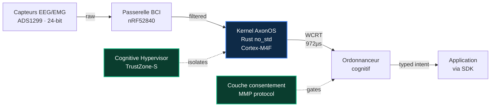
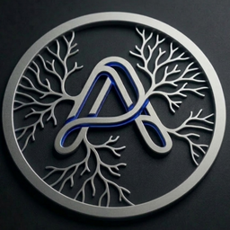

<div align="center">


<br/>
<br/>

# **axonos**

### Le système d'exploitation cognitif ouvert pour les interfaces cerveau-ordinateur.

<br/>

[](./README.md)
[](./README.ja.md)
[](./README.zh.md)
[](./README.it.md)
[](./README.fr.md)
[](./README.de.md)
[](./README.es.md)
[](./README.ar.md)

<br/>

[](https://github.com/AxonOS-org/axonos-sdk)
[](https://github.com/AxonOS-org/AxonOS-kernel)
[](https://axonos.org/specifications.html)
[](https://www.rust-lang.org/)
[](#licensing)

### [🌐 axonos.org](https://axonos.org) · [📐 Spécifications](https://axonos.org/specifications.html) · [🧰 SDK](https://axonos.org/sdk.html) · [📖 Articles](https://medium.com/@AxonOS) · [💬 connect@axonos.org](mailto:connect@axonos.org)

</div>

---

## Projet AxonOS

<br/>

**AxonOS est un système d'exploitation neuronal temps réel strict pour interfaces cerveau-ordinateur.** Noyau open-source en `#![no_std]` Rust. Gigue inférieure à la milliseconde sur ARM Cortex-M grand public. Temps de réponse au pire cas formellement borné. Confidentialité structurelle que la couche applicative ne peut pas contourner.

Conçu pour les patients qui dépendent d'interfaces assistives en boucle fermée, et pour les ingénieurs qui refusent de les livrer sur du best-effort scheduling.

<br/>

## Pourquoi AxonOS existe

Aujourd'hui, chaque application BCI doit re-parser un format binaire propriétaire par appareil, ré-implémenter le contrôle de capacités, et réécrire le code d'intégration pour chaque nouvelle plateforme matérielle.

**AxonOS fait les trois en une seule fois, en Rust `no_std` sûr, au-dessus d'un microkernel formellement borné.** Une seule base vérifiable. Une seule surface d'API typée. De nombreux backends matériels.

<br/>

## Les quatre engagements

<br/>

|     | Engagement                    | Ce que cela signifie en pratique                                                                                                  |
|:---:|:------------------------------|:----------------------------------------------------------------------------------------------------------------------------------|
| 🦀  | **Temps réel strict sur matériel commercial** | Rust `#![no_std]` sur ARMv8-M. Pas de GC, pas d'allocateur sur le chemin critique, pas de panics illimités.   |
| 📐  | **WCRT formellement borné**   | Chaque opération du chemin critique a une borne supérieure vérifiée par Kani. La latence est *prouvée*, pas mesurée.            |
| 🔒  | **Confidentialité structurelle** | Les capacités qui feraient fuir l'état cognitif brut (`RawEEG`, `EmotionState`, `CognitiveProfile`) n'existent pas en tant que types. |
| 🌐  | **Écosystème ouvert**         | Apache-2.0 OR MIT pour le code, CC-BY-SA-4.0 pour les spécifications. Tous les dépôts sont publics. Chaque couche est auditable, forkable, remplaçable. |

<br/>

## Démarrage rapide

Soixante secondes du clone à votre première observation d'intention.

```sh
git clone https://github.com/AxonOS-org/axonos-sdk
cd axonos-sdk
cargo test --features std
```

```rust
use axonos_sdk::{Capability, IntentStream, Manifest};

let manifest = Manifest::builder()
    .app_id("com.example.cursor")?
    .capability(Capability::Navigation)
    .max_rate_hz(50)
    .build()?;

let mut stream = IntentStream::connect(&manifest)?;
while let Some(obs) = stream.try_next()? {
    println!("{:?} @ {} µs ({}%)",
        obs.kind(),
        obs.timestamp().as_micros(),
        obs.confidence_percent());
}
```

Le SDK est le binding Rust de référence. Les bindings C FFI, Python, WebAssembly, JNI et Swift figurent dans la [feuille de route publique](https://axonos.org/sdk.html).

<br/>

## Les dépôts

Les six dépôts sont publics. Code source sous Apache-2.0 OR MIT. Spécifications sous CC-BY-SA-4.0.

|                                                                              | Dépôt                | Objectif                                                                          | Langage  | Dernière   |
|:----------------------------------------------------------------------------:|:---------------------|:----------------------------------------------------------------------------------|:--------:|:-----------|
| [⬢](https://github.com/AxonOS-org/AxonOS-kernel)                              | **AxonOS-kernel**    | Microkernel temps réel strict — 8 crates, WCRT formellement borné, 28 harnais Kani | Rust     | `v0.2.1`   |
| [⬢](https://github.com/AxonOS-org/axonos-sdk)                                 | **axonos-sdk**       | Frontière applicative — intentions typées, manifestes de capacités, ABI kernel v1 | Rust     | `v0.3.4`   |
| [⬢](https://github.com/AxonOS-org/axonos-consent)                             | **axonos-consent**   | Consentement au niveau protocole pour le couplage cognitive mesh (MMP)            | Rust     | `v0.4.0`   |
| [⬢](https://github.com/AxonOS-org/axonos-swarm)                               | **axonos-swarm**     | Coordination multi-nœuds — synchronisation Neural PTP, ordonnancement de swarm    | Rust     | `v0.2.0`   |
| [⬢](https://github.com/AxonOS-org/axonos-rfcs)                                | **axonos-rfcs**      | Spécifications d'ingénierie — 8 RFC numérotés, normatifs, CC-BY-SA-4.0            | Markdown | actif      |
| [⬢](https://github.com/AxonOS-org/axon-bci-gateway)                           | **axon-bci-gateway** | Passerelle d'acquisition matérielle (fork d'OpenBCI, MIT préservé de l'upstream)  | HTML     | actif      |

<br/>

## Architecture

<br/>



<br/>

## Les chiffres

<br/>

<table align="center">
<tr>
  <td align="center" width="200">
    <h2>972 µs</h2>
    <sub>WCRT du kernel, mesuré<br/>STM32F407 @ 168 MHz</sub>
  </td>
  <td align="center" width="200">
    <h2>2.1 µs</h2>
    <sub>Gigue σ au pire cas<br/>vs Linux 1323 µs</sub>
  </td>
  <td align="center" width="200">
    <h2>630×</h2>
    <sub>Facteur d'amélioration<br/>vs Linux mainline</sub>
  </td>
</tr>
<tr>
  <td align="center">
    <h2>28</h2>
    <sub>Harnais Kani BMC<br/>bornes supérieures prouvées</sub>
  </td>
  <td align="center">
    <h2>66+</h2>
    <sub>Tests unitaires et d'intégration<br/>dans tout l'espace de travail</sub>
  </td>
  <td align="center">
    <h2>42+</h2>
    <sub>Articles d'architecture<br/>publiés sur Medium</sub>
  </td>
</tr>
</table>

<br/>

## Statut

<br/>

| Phase        | Contenu                                                                                    | Échéance     |
|:-------------|:-------------------------------------------------------------------------------------------|:-------------|
| **Phase 0**  | Architecture, RFC, API du SDK, harnais de vérification du kernel                            | ✓ Terminé    |
| **Phase 1**  | Kit de développement clinique (8 canaux) · pilote au centre ALS                            | 🟡 Q2 2026   |
| **Phase 2**  | FDA 510(k) Q-Sub pour Cognitive Hypervisor · contribution IEEE P2731                       | 🔵 Q3 2026   |
| **Phase 3**  | Premier déploiement commercial via les membres de la Foundation                             | 🔵 2027      |

<br/>

## Licences

| Artefact                              | Licence                                            |
|:--------------------------------------|:---------------------------------------------------|
| Kernel, SDK, consent, swarm, gateway  | Apache-2.0 OR MIT                                  |
| RFC et spécifications                 | CC-BY-SA-4.0                                       |
| `axon-bci-gateway`                    | MIT (préservé depuis l'upstream OpenBCI_GUI)       |

<br/>
<br/>

---

<div align="center">



<br/>
<br/>

**Construit et maintenu par Denis Yermakou**

[denis@axonos.org](mailto:denis@axonos.org) · [LinkedIn](https://www.linkedin.com/in/denis-yermakou) · [Medium](https://medium.com/@AxonOS) · [Site](https://axonos.org)

<sub>Singapore · Zurich · Berlin · Milano · San Mateo</sub>

<br/>

<sub>Construit avec Rust. Vérifié avec Kani. Conçu pour le temps réel strict.</sub>

</div>
