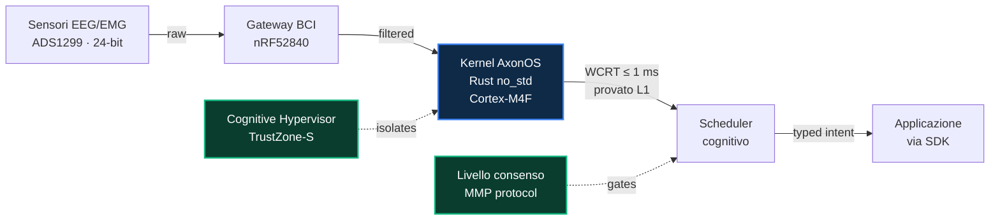

<div align="center">


<br/>
<br/>

# **axonos**

### Il sistema operativo cognitivo aperto per le interfacce cervello-computer.

*La pagina inglese è quella canonica e viene aggiornata per prima; i dati live e le sezioni più recenti compaiono [lì](./README.md).*

<br/>

[](./README.md)
[](./README.ja.md)
[](./README.zh.md)
[](./README.it.md)
[](./README.fr.md)
[](./README.de.md)
[](./README.es.md)
[](./README.ar.md)

<br/>

[](https://github.com/AxonOS-org/axonos-sdk)
[](https://github.com/AxonOS-org/AxonOS-kernel)
[](https://axonos.org/specifications.html)
[](https://www.rust-lang.org/)
[](#licenze)

### [axonos.org](https://axonos.org) · [Specifiche](https://axonos.org/specifications.html) · [SDK](https://axonos.org/sdk.html) · [Articoli](https://medium.com/@AxonOS) · [connect@axonos.org](mailto:connect@axonos.org)

</div>

---

## Progetto AxonOS

<br/>

**AxonOS è un sistema operativo neurale hard real-time per interfacce cervello-computer.** Kernel open-source in `#![no_std]` Rust. Jitter sotto il millisecondo su ARM Cortex-M commerciale. Tempo di risposta nel caso peggiore formalmente limitato. Privacy strutturale che il livello applicativo non può aggirare.

Costruito per i pazienti che dipendono da interfacce assistive a ciclo chiuso, e per gli ingegneri che si rifiutano di rilasciarle su scheduling best-effort.

<br/>

## Perché AxonOS esiste

Oggi ogni applicazione BCI deve ri-analizzare un formato binario proprietario per ciascun dispositivo, ri-implementare il gating delle capability, e riscrivere il codice di integrazione per ogni nuova piattaforma hardware.

**AxonOS fa tutte e tre le cose una volta sola, in `no_std` Rust sicuro, sopra un microkernel formalmente vincolato.** Una base verificabile. Una superficie API tipata. Molti backend hardware.

<br/>

## I quattro impegni

<br/>

|  | Impegno | Cosa significa nella pratica |
|:---:|:---|:---|
| | **Hard real-time su hardware commerciale** | Rust `#![no_std]` su ARMv8-M. Niente GC, niente allocator nel percorso critico, niente panic illimitati. |
| | **WCRT formalmente vincolato** | Ogni operazione del percorso critico ha un limite superiore verificato da Kani. La latenza è *dimostrata*, non misurata. |
| | **Privacy strutturale** | Le capability che farebbero trapelare stato cognitivo grezzo (`RawEEG`, `EmotionState`, `CognitiveProfile`) non esistono come tipi. |
| | **Ecosistema aperto** | Apache-2.0 OR MIT per il codice, CC-BY-SA-4.0 per le specifiche. Tutti i repository sono pubblici. Chiunque può fare audit, fork o sostituire qualsiasi strato. |

<br/>

## Avvio rapido

Sessanta secondi dal clone alla prima osservazione di intento.

```sh
git clone https://github.com/AxonOS-org/axonos-sdk
cd axonos-sdk
cargo test --features std
```

```rust
use axonos_sdk::{Capability, IntentStream, Manifest};

let manifest = Manifest::builder()
    .app_id("com.example.cursor")?
    .capability(Capability::Navigation)
    .max_rate_hz(50)
    .build()?;

let mut stream = IntentStream::connect(&manifest)?;
while let Some(obs) = stream.try_next()? {
    println!("{:?} @ {} µs ({}%)",
        obs.kind(),
        obs.timestamp().as_micros(),
        obs.confidence_percent());
}
```

L'SDK è il binding Rust di riferimento. I binding C FFI, Python, WebAssembly, JNI e Swift sono nella [roadmap pubblicata](https://axonos.org/sdk.html).

<br/>

## I repository

Tutti i sei repository sono pubblici. Codice sorgente sotto Apache-2.0 OR MIT. Specifiche sotto CC-BY-SA-4.0.

|  | Repository | Scopo | Linguaggio | Ultima |
|:---:|:---|:---|:---:|:---|
| [⬢](https://github.com/AxonOS-org/AxonOS-kernel) | **AxonOS-kernel** | Microkernel hard real-time — 8 crate, WCRT formalmente vincolato, 28 harness Kani | Rust | `v0.3.0` |
| [⬢](https://github.com/AxonOS-org/axonos-sdk) | **axonos-sdk** | Confine applicativo — intent tipati, manifest di capability, ABI del kernel v1 | Rust | `v0.3.5` |
| [⬢](https://github.com/AxonOS-org/axonos-consent) | **axonos-consent** | Enforcement del consenso a livello di protocollo per il cognitive mesh (MMP) | Rust | `v0.5.0` |
| [⬢](https://github.com/AxonOS-org/axonos-swarm) | **axonos-swarm** | Coordinamento multi-nodo — sincronizzazione Neural PTP, scheduling di swarm | Rust | `v0.2.1` |
| [⬢](https://github.com/AxonOS-org/axonos-rfcs) | **axonos-rfcs** | Specifiche di ingegneria — 8 RFC numerati, normativi, CC-BY-SA-4.0 | Markdown | attivo |
| [⬢](https://github.com/AxonOS-org/axon-bci-gateway) | **axon-bci-gateway** | Gateway di acquisizione hardware (fork di OpenBCI, MIT preservato dall'upstream) | HTML | attivo |

<br/>

## Architettura

<br/>



**Come leggere lo schema.** Da sinistra a destra, dall'elettrodo all'intento. Il kernel (blu) *rifiuta* le scadenze: una configurazione che non può garantire non viene ammessa. I due nodi verdi sono confini — il Cognitive Hypervisor isola, il livello di consenso autorizza.

Lo schema mostra la struttura, non afferma prestazioni. I numeri sono nella sezione seguente, ciascuno con il proprio livello di evidenza.

<br/>

## I numeri

Ogni cifra porta con sé **come** è stata stabilita. L1 è verificata a macchina: si può eseguire `cargo kani` e controllare. L2 è misurata su hardware di riferimento, con le tracce grezze non ancora pubblicate. L3 è riproduzione indipendente, e **non è rivendicata per alcuna cifra**.

Accuratezza di classificazione, tasso di trasferimento e consumo non sono misurati. Non compaiono stime, perché il progetto non li misura.

<br/>

<table align="center">
<tr>
  <td align="center" width="200">
    <h2>≤ 1 ms</h2>
    <sub>WCRT del kernel, dimostrato (L1)<br/>STM32F407 @ 168 MHz</sub>
  </td>
  <td align="center" width="200">
    <h2>2.1 µs</h2>
    <sub>Jitter σ caso peggiore<br/>vs Linux 1323 µs</sub>
  </td>
  <td align="center" width="200">
    <h2>630×</h2>
    <sub>Fattore di miglioramento<br/>vs Linux mainline</sub>
  </td>
</tr>
<tr>
  <td align="center">
    <h2>30</h2>
    <sub>Harness Kani BMC<br/>limiti superiori provati</sub>
  </td>
  <td align="center">
    <h2>66+</h2>
    <sub>Test unitari e di integrazione<br/>nell'intero workspace</sub>
  </td>
  <td align="center">
    <h2>42+</h2>
    <sub>Articoli di architettura<br/>pubblicati su Medium</sub>
  </td>
</tr>
</table>

<br/>

## Stato

<br/>

| Fase | Contenuto | Quando |
|:---|:---|:---|
| **Fase 0** | Architettura, RFC, API dell'SDK, harness di verifica del kernel | Completato |
| **Fase 1** | Kit di sviluppo clinico (8 canali) · pilota presso centro ALS | in attesa di un banco di misura strumentato, non ancora acquistato; nessuna data, perché sarebbe inventata |
| **Fase 2** | FDA 510(k) Q-Sub per Cognitive Hypervisor · contributo IEEE P2731 | dopo la Fase 1 |
| **Fase 3** | Primo deployment commerciale tramite membri della Foundation | dopo la Fase 2 |

<br/>

## Licenze

| Artefatto | Licenza |
|:---|:---|
| Kernel, SDK, consent, swarm, gateway | Apache-2.0 OR MIT |
| RFC e specifiche | CC-BY-SA-4.0 |
| `axon-bci-gateway` | MIT (preservato dall'upstream OpenBCI_GUI) |

<br/>
<br/>

---

<div align="center">


<br/>
<br/>

**Costruito e mantenuto da Denis Yermakou**

[denis@axonos.org](mailto:denis@axonos.org) · [LinkedIn](https://www.linkedin.com/in/denis-yermakou) · [Medium](https://medium.com/@AxonOS) · [Site](https://axonos.org)

<sub>Singapore · Zurich · Berlin · Milano · San Mateo</sub>

<br/>

<sub>Costruito con Rust. Verificato con Kani. Mirato all'hard real-time.</sub>

</div>
