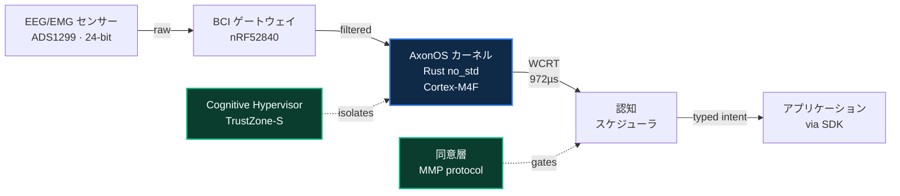

<div align="center">


<br/>
<br/>

# **axonos**

### ブレイン・コンピュータ・インターフェースのためのオープン認知オペレーティングシステム。

<br/>

[](./README.md)
[](./README.ja.md)
[](./README.zh.md)
[](./README.it.md)
[](./README.fr.md)
[](./README.de.md)
[](./README.es.md)
[](./README.ar.md)

<br/>

[](https://github.com/AxonOS-org/axonos-sdk)
[](https://github.com/AxonOS-org/axonos-kernel)
[](https://axonos.org/specifications.html)
[](https://www.rust-lang.org/)
[](#licensing)

### [🌐 axonos.org](https://axonos.org) · [📐 仕様](https://axonos.org/specifications.html) · [🧰 SDK](https://axonos.org/sdk.html) · [📖 記事](https://medium.com/@AxonOS) · [💬 connect@axonos.org](mailto:connect@axonos.org)

</div>

---

## プロジェクト AxonOS

<br/>

**AxonOS は、ブレイン・コンピュータ・インターフェースのためのハードリアルタイム神経オペレーティングシステムです。** `#![no_std]` Rust で書かれたオープンソースカーネル。汎用 ARM Cortex-M 上でサブミリ秒のジッタを実現。最悪応答時間 (WCRT) は形式的に上限が保証されます。アプリケーション層が回避できない構造的プライバシー。

クローズドループ補助インターフェースに依存する患者のため、そしてベストエフォートスケジューリングで製品を出荷することを拒否するエンジニアのために構築されています。

<br/>

## なぜ AxonOS が存在するのか

今日、すべての BCI アプリケーションは、デバイスごとに独自のバイナリワイヤーフォーマットを再解析し、機能ゲーティングを再実装し、新しいハードウェアプラットフォームごとに統合コードを書き直さなければなりません。

**AxonOS は、形式的に境界づけられたマイクロカーネル上で、安全な `no_std` Rust によりこれら 3 つを一度に行います。** 1 つの検証可能な基盤。1 つの型付き API。多数のハードウェアバックエンド。

<br/>

## 4 つの約束

<br/>

|     | 約束                          | 実際の意味                                                                                                                            |
|:---:|:------------------------------|:--------------------------------------------------------------------------------------------------------------------------------------|
| 🦀  | **汎用ハードウェアでのハードリアルタイム** | ARMv8-M 上の `#![no_std]` Rust。GC なし、ホットパスにアロケータなし、無制限のパニックなし。メモリ安全性は構造的に保証されます。  |
| 📐  | **形式的に境界づけられた WCRT** | すべてのクリティカルパス操作には Kani 検証済みの上限があります。レイテンシは測定されるのではなく*証明*されます。                |
| 🔒  | **構造的プライバシー**        | 生の認知状態を漏洩する機能 (`RawEEG`、`EmotionState`、`CognitiveProfile`) は型として存在しません。                                  |
| 🌐  | **オープンエコシステム**      | コードは Apache-2.0 または MIT、仕様は CC-BY-SA-4.0。すべてのリポジトリが公開されています。誰でも監査・フォーク・置き換え可能。  |

<br/>

## クイックスタート

クローンから最初のインテント観測まで 60 秒。

```sh
git clone https://github.com/AxonOS-org/axonos-sdk
cd axonos-sdk
cargo test --features std
```

```rust
use axonos_sdk::{Capability, IntentStream, Manifest};

let manifest = Manifest::builder()
    .app_id("com.example.cursor")?
    .capability(Capability::Navigation)
    .max_rate_hz(50)
    .build()?;

let mut stream = IntentStream::connect(&manifest)?;
while let Some(obs) = stream.try_next()? {
    println!("{:?} @ {} µs ({}%)",
        obs.kind(),
        obs.timestamp().as_micros(),
        obs.confidence_percent());
}
```

SDK は Rust リファレンスバインディングです。C FFI、Python、WebAssembly、JNI、Swift のバインディングは [公開ロードマップ](https://axonos.org/sdk.html) に記載されています。

<br/>

## リポジトリ

すべての 6 つのリポジトリは公開されています。ソースコードは Apache-2.0 または MIT、仕様は CC-BY-SA-4.0 のもとで提供されます。

|                                                                              | リポジトリ           | 目的                                                                              | 言語     | 最新       |
|:----------------------------------------------------------------------------:|:---------------------|:----------------------------------------------------------------------------------|:--------:|:-----------|
| [⬢](https://github.com/AxonOS-org/axonos-kernel)                              | **axonos-kernel**    | ハードリアルタイムマイクロカーネル — 8 クレート、形式的に境界づけられた WCRT、28 Kani ハーネス | Rust     | `v0.2.1`   |
| [⬢](https://github.com/AxonOS-org/axonos-sdk)                                 | **axonos-sdk**       | アプリケーション境界 — 型付きインテント、能力マニフェスト、カーネル ABI v1            | Rust     | `v0.3.4`   |
| [⬢](https://github.com/AxonOS-org/axonos-consent)                             | **axonos-consent**   | 認知メッシュカップリングのためのプロトコルレベル同意施行 (MMP)                       | Rust     | `v0.4.0`   |
| [⬢](https://github.com/AxonOS-org/axonos-swarm)                               | **axonos-swarm**     | マルチノード調整 — Neural PTP 同期、スウォームスケジューリング                       | Rust     | `v0.2.0`   |
| [⬢](https://github.com/AxonOS-org/axonos-rfcs)                                | **axonos-rfcs**      | 工学仕様書 — 8 つの番号付き RFC、規範的、CC-BY-SA-4.0                                 | Markdown | active     |
| [⬢](https://github.com/AxonOS-org/axon-bci-gateway)                           | **axon-bci-gateway** | ハードウェア取得ゲートウェイ (OpenBCI フォーク、上流から MIT 保持)                   | HTML     | active     |

<br/>

## アーキテクチャ

<br/>



<br/>

## 数字で見る

<br/>

<table align="center">
<tr>
  <td align="center" width="200">
    <h2>972 µs</h2>
    <sub>カーネル WCRT 実測<br/>STM32F407 @ 168 MHz</sub>
  </td>
  <td align="center" width="200">
    <h2>2.1 µs</h2>
    <sub>最悪ジッタ σ<br/>Linux 1323 µs に対して</sub>
  </td>
  <td align="center" width="200">
    <h2>630×</h2>
    <sub>改善倍率<br/>Linux mainline 比</sub>
  </td>
</tr>
<tr>
  <td align="center">
    <h2>28</h2>
    <sub>Kani BMC ハーネス<br/>上限を証明</sub>
  </td>
  <td align="center">
    <h2>66+</h2>
    <sub>ユニット・統合テスト<br/>ワークスペース全体</sub>
  </td>
  <td align="center">
    <h2>42+</h2>
    <sub>長文アーキテクチャ記事<br/>Medium 上で</sub>
  </td>
</tr>
</table>

<br/>

## ステータス

<br/>

| フェーズ      | 内容                                                                                              | 時期        |
|:--------------|:--------------------------------------------------------------------------------------------------|:------------|
| **フェーズ 0** | アーキテクチャ、RFC、SDK API、カーネル検証ハーネス                                                    | ✓ 完了      |
| **フェーズ 1** | 臨床グレード 8 チャンネル開発キット · ALS センター臨床試験                                              | 🟡 2026 Q2  |
| **フェーズ 2** | Cognitive Hypervisor の FDA 510(k) Q-Sub · IEEE P2731 寄稿                                          | 🔵 2026 Q3  |
| **フェーズ 3** | Foundation メンバーによる初の商用展開                                                                | 🔵 2027     |

<br/>

## ライセンス

| 成果物                                | ライセンス                                          |
|:--------------------------------------|:----------------------------------------------------|
| カーネル、SDK、consent、swarm、gateway | Apache-2.0 OR MIT                                   |
| RFC と仕様書                           | CC-BY-SA-4.0                                        |
| `axon-bci-gateway`                    | MIT (上流の OpenBCI_GUI から保持)                   |

<br/>
<br/>

---

<div align="center">


<br/>
<br/>

**構築と保守:Denis Yermakou**

[connect@axonos.org](mailto:connect@axonos.org) · [LinkedIn](https://www.linkedin.com/in/denis-yermakou) · [Medium](https://medium.com/@AxonOS) · [Site](https://axonos.org)

<sub>Singapore · Zurich · Berlin · Milano · San Mateo</sub>

<br/>

<sub>Rust で構築。Kani で検証。ハードリアルタイムを目指して。</sub>

</div>
