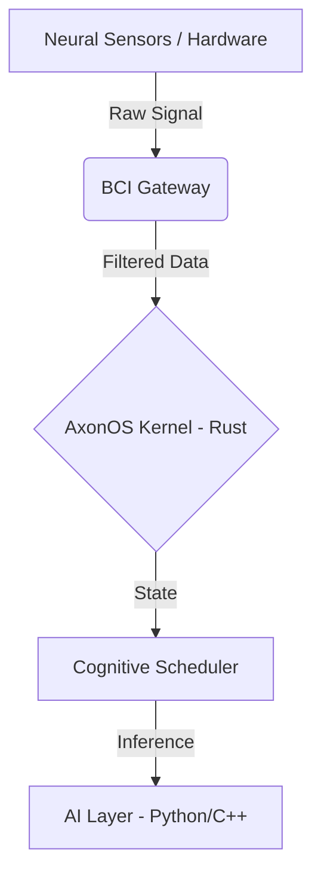

<div align="center">
  <h1>AxonOS</h1>
  <p><b>A deterministic cognitive OS that converts neural signals into intent under strict latency, privacy, and consent guarantees.</b></p>
  <p>
    <a href="https://medium.com/@AxonOS">Medium</a> •
    <a href="https://www.linkedin.com/in/axonos">Linkedin</a>
  </p>
</div>

## ⚙️ Core Vision
AxonOS is a bare-metal operating system designed to process neural signals (EEG/EMG) with zero-overhead latency, ensuring memory safety and deterministic execution for real-time AI inference.

## 🛠 Tech Stack
* **Kernel & Core OS:** `Rust` (Strict adherence to memory safety, zero-cost abstractions, fearless concurrency).
* **Hardware Interface (BCI Gateway):** `Rust`, `C` (Low-level sensor integration).
* **AI/ML Abstraction Layer:** `Python`, `C++` (Isolated execution for cognitive models).

## 🏗 Architecture Overview


📂 Open Source Ecosystem
axonos-sdk: Public Rust SDK for interacting with the AxonOS ecosystem. Contains public API traits, memory-safe data structures for telemetry parsing, and integration stubs.
# AxonOS

**A `#![no_std]` Rust microkernel for hard real-time brain-computer interface signal processing.**

Motor imagery → deterministic intent → silicon-level execution. No GC. No jitter.

[](https://axonos.org)
[](https://medium.com/@AxonOS)
[](https://www.linkedin.com/in/axonos)

---

## What AxonOS Is

Most BCI software runs on Linux, RTOS, or Python stacks — general-purpose platforms with non-deterministic schedulers, garbage collectors, and millisecond-scale jitter. For a system that must close the neural feedback loop within a single 4 ms EEG sampling window, this is the wrong foundation.

AxonOS is a purpose-built bare-metal microkernel. It runs directly on STM32H573 (ARM Cortex-M33, 120 MHz), owns every clock cycle, and processes 8-channel EEG from DMA interrupt to signed `IntentObservation` packet in a verified worst-case of **618 µs** — 6× inside the 4 ms sampling window, with **2.4 µs RMS jitter** over 24-hour stress tests.

The output is not raw signal. It is a typed, cryptographically attested intent event that third-party applications receive through a WASM sandbox — with no path to the underlying neural data.

---

## Architecture

```
┌─────────────────────────────────────────────────────────────────┐
│  TrustZone Secure World  (STM32H573 SRAM1/2)                    │
│                                                                 │
│  ADC/DMA (250 Hz, 8ch, 16-bit)                                  │
│    └─► Artifact Gate (amplitude threshold → Kalman predict)     │
│    └─► Hanning window → CSP spatial filter (8ch → 2ch)          │
│    └─► RFFT 128pt × 2ch (CMSIS-DSP, FPU, ~312 µs)               │
│    └─► Band-power extraction (mu/beta 8–30 Hz)                  │
│    └─► MDM Riemannian classifier → posterior distribution       │
│    └─► Confidence gate (posterior > θ_user AND rejection check) │
│    └─► IntentObservation { intent_id, posterior_q16,            │
│                            timestamp_us, hmac_sha256 }          │
│                                  │                              │
│              NSC Gateway (only crossing point)                  │
│                                  │                              │
├──────────────────────────────────┼──────────────────────────────┤
│  Non-Secure World                ▼                              │
│                                                                 │
│  SPSC Ring Buffer (lock-free, wait-free)                        │
│    └─► WASM Application Sandbox                                 │
│          └─► Neural Permissions Firewall                        │
│                (capability manifest enforced at load time)      │
│                └─► Third-party application                      │
│                      receives: typed event + confidence         │
│                      cannot access: raw EEG, features, keys     │
└─────────────────────────────────────────────────────────────────┘

BLE 5.2 (nRF52840) — connection interval 7.5 ms, ATT notify
```

**EDF task schedule (Cortex-M33 NVIC, verified feasible at 19% utilisation):**

| Task | Period | WCET | Utilisation |
|---|---|---|---|
| Neural Decoder ISR | 4 ms | 618 µs | 15.5% |
| Intent Dispatcher | 20 ms | 400 µs | 2.0% |
| Session Auth Layer | 100 ms | 1500 µs | 1.5% |
| **Total** | | | **19.0%** |

---

## Hardware Target

| Component | Part | Notes |
|---|---|---|
| MCU | STM32H573IIK3 | Cortex-M33 @ 120 MHz, FPU, AES, TrustZone-M |
| EEG frontend | ADS1299 (8ch) | 24-bit ADC, 250 SPS per channel, SPI to MCU |
| Radio | nRF52840 | BLE 5.2, 7.5 ms connection interval, UART bridge |
| Security | TrustZone-M | Partitioned SRAM: Secure (pipeline) / Non-Secure (apps) |
| Memory | 640 KB SRAM | SRAM1/2 Secure, SRAM3 Non-Secure, no heap in RT path |
| Power | Li-Po 300 mAh | ~20–24 h continuous operation at 7.1 mA average |

---

## Performance (Measured, STM32H573, GPIO + DWT_CYCCNT)

| Metric | Value | Method |
|---|---|---|
| Pipeline WCET | **618 µs** | 10,000 frames, logic analyser @ 100 MHz |
| RMS jitter | **2.4 µs** | 10,000 frames, DWT_CYCCNT |
| 24h budget overruns | **0** | Continuous synthetic MI signal |
| Average system current | **7.1 mA** | MCU 5.26 mA + BLE 1.8 mA @ 3.3V |
| Practical battery life | **20–24 h** | 300 mAh Li-Po, measured discharge |
| Artifact frame rate | **18–22%** | Ambulatory use, 5 subjects |
| Decoder accuracy (MI 2-class) | **85–95%** | Blankertz et al., 2008 |

Full methodology: [Article #12 — Benchmark Report](https://medium.com/@AxonOS/axonos-mvp-the-benchmark-report-latency-power-ea6c78d0e091)

---

## Tech Stack

**Kernel (RT pipeline) — `#![no_std]` Rust, bare metal:**
- No heap allocation in the RT path — all buffers statically allocated
- No OS scheduler — EDF via NVIC priority assignment, WCET-verified
- No blocking calls — DMA-driven acquisition, interrupt-driven processing
- Memory safety enforced by Rust borrow checker + TrustZone SRAM partitioning

**Signal processing:**
- CMSIS-DSP (arm_rfft_fast_f32, arm_mat_mult_f32) via Rust FFI
- Common Spatial Patterns (CSP) spatial filter, pre-computed at calibration
- Riemannian MDM classifier — geodesic distance on SPD manifold
- Adaptive Kalman filter with online covariance estimation

**Security:**
- TrustZone-M: raw EEG physically isolated in Secure World SRAM
- HMAC-SHA256 attestation on every `IntentObservation` (~2 µs overhead)
- WASM linear memory isolation for application layer (Haas et al., 2017)
- Capability manifest: Ed25519-signed, kernel-enforced at load time

**What is not in the kernel:**
- Python — incompatible with `#![no_std]` bare-metal execution
- Dynamic allocation (`malloc` / `Box` / `Vec` in RT path)
- Linux, RTOS, or any general-purpose OS layer
- Cloud connectivity — local-first architecture, neural data never leaves device

---

## Repositories

| Repo | Language | Status | Description |
|---|---|---|---|
| [`axonos-sdk`](https://github.com/AxonOS-org/axonos-sdk) | Rust | Public | SDK for AxonOS applications: `IntentObservation` types, capability API, WASM host bindings |
| `axonos-kernel` | Rust | Private | Bare-metal microkernel: DMA pipeline, EDF scheduler, TrustZone partition, NSC gateway |
| `axonos-dsp` | Rust | Private | Signal processing: CSP, MDM classifier, Kalman filter, artifact rejection |
| `axonos-sim` | Rust | Private | Hardware-in-the-loop simulator: synthetic MI signal generation, benchmark dataset replay |
| [`axon-bci-gateway`](https://github.com/AxonOS-org/axon-bci-gateway) | — | Public (fork) | OpenBCI GUI fork — used for early hardware bring-up and electrode placement validation |

**Note on private repositories:** The core kernel and DSP pipeline are maintained in private repositories during the pre-release phase. The `axonos-sdk` contains the public API surface: types, traits, and capability definitions that third-party developers build against. The private kernel implements the other side of that API.

---

## Privacy Architecture

Neural data in AxonOS follows one direction and one direction only:

```
Raw EEG (Secure World SRAM)
    │
    ▼  [never crosses this boundary as raw signal]
IntentObservation (typed, signed, confidence-bearing)
    │
    ▼
WASM Application Sandbox
    │
    ▼
Third-party application
    (receives: intent class + confidence + attestation tag)
    (cannot access: electrode voltages, band features, biometric identifiers)
```

Applications declare their capability scope in a signed manifest at install time. The kernel binds only the declared host functions to the WASM instance — an application cannot call a function for a capability it didn't declare because that function does not exist in its execution environment. Enforcement is structural, not policy-based.

Neural Permissions capability classes: `NavigationIntents` (85–95% accuracy), `WorkloadAdvisory` (~70%, binary), `SessionQuality`, `ArtifactEvents`.

Not available as capabilities: `RawEEG` (architectural boundary), `EmotionState` (60–70% accuracy, insufficient for consent), `FlowState` (not reliably detectable in real-time), `CognitiveProfile` (prohibited).

Full architecture: [Articles #3, #7, #9, #10](https://medium.com/@AxonOS)

---

## Engineering Series

30 articles covering the full architecture, from DMA buffers to neuroethics law:

- [#1 Signal Supremacy](https://medium.com/@AxonOS) — Why EEG jitter destroys phase coherence and how adaptive Kalman filtering handles it
- [#4 Zero-Jitter Microkernel](https://medium.com/@AxonOS) — EDF scheduling, SPSC ring buffers, WCET analysis
- [#7 Privacy Protocol](https://medium.com/@AxonOS) — TrustZone memory map, HMAC attestation, timing attack surface
- [#10 E2E Intent Routing](https://medium.com/@AxonOS) — Curve25519/AES-GCM, SPSC airgap, what orthogonal projection can and cannot guarantee
- [#12 Benchmark Report](https://medium.com/@AxonOS/axonos-mvp-the-benchmark-report-latency-power-ea6c78d0e091) — 618 µs WCET, 2.4 µs jitter, 20h battery life — measured on hardware
- [#13 Riemannian Geometry](https://medium.com/@AxonOS) — MDM classifier, Euclidean Alignment, session-to-session adaptation
- [#29 Cognitive Hypervisor](https://medium.com/@AxonOS) — Shannon-McCreery damage limits, stimulation safety architecture for bidirectional BCIs
- [#30 Developer Ecosystem](https://medium.com/@AxonOS) — Capability manifest, app signing pipeline, SDK onboarding

→ [Full series at medium.com/@AxonOS](https://medium.com/@AxonOS)

---

## Status

**Current phase:** MVP hardware validation + SDK alpha

- ✅ Bare-metal pipeline verified on STM32H573 (618 µs WCET, 0 overruns / 24h)
- ✅ TrustZone partition implemented and tested
- ✅ Riemannian MDM classifier: 85–95% accuracy, 2-class MI, 5 subjects
- ✅ `axonos-sdk` public API alpha
- 🔄 Euclidean Alignment transfer learning (session cold-start < 60 s)
- 🔄 Peripheral FES feedback path + Cognitive Hypervisor (stimulation safety)
- 🔄 `axonos-cli` + simulator public release
- ⬜ AxonOS App Directory + capability manifest registry
- ⬜ CE/FDA regulatory pathway (readout-only class I, bidirectional class III)

---

## Organisation

**Founder:** Denis Yermakou
**Jurisdiction:** Singapore
**R&D:** Remote-first

**Contact:**
- E-Mail : [axonosorg@gmail.com](mailto:axonOSorg@gmail.com)
---

*AxonOS. Pure signal. Zero noise.*

Note: The core kernel and proprietary ML modules are maintained in private repositories.

🏢 Organization
Jurisdiction: Singapore

R&D Base: Bali, Indonesia


