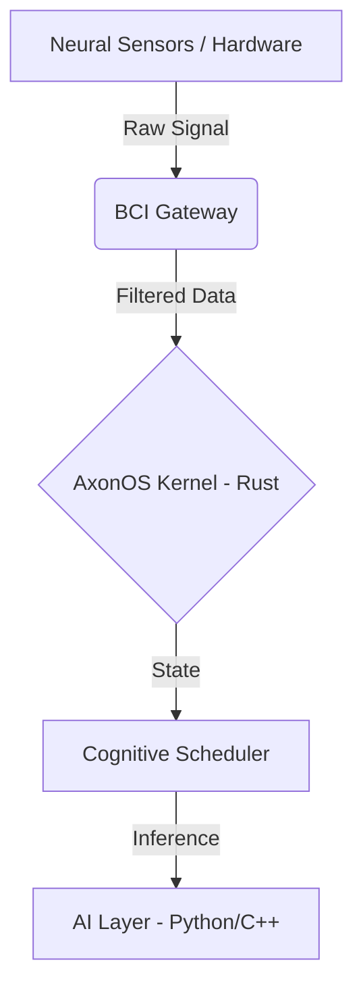

  <h1>AxonOS</h1>
  
<b>Cognitive Operating System bridging AI and Brain-Computer Interfaces.</b>

  

    <a href="http://AxonOS.org">Website</a> •
    <a href="https://medium.com/@AxonOS">Medium</a> •
    <a href="https://wellfound.com/u/denis-yermakou">Wellfound</a>
  

## ⚙️ Core Vision
AxonOS is a bare-metal operating system designed to process neural signals (EEG/EMG) with zero-overhead latency, ensuring memory safety and deterministic execution for real-time AI inference.

## 🛠 Tech Stack
* **Kernel & Core OS:** `Rust` (Strict adherence to memory safety, zero-cost abstractions, fearless concurrency).
* **Hardware Interface (BCI Gateway):** `Rust`, `C` (Low-level sensor integration).
* **AI/ML Abstraction Layer:** `Python`, `C++` (Isolated execution for cognitive models).

## 🏗 Architecture Overview

📂 Open Source Ecosystem
axonos-sdk: Public Rust SDK for interacting with the AxonOS ecosystem. Contains public API traits, memory-safe data structures for telemetry parsing, and integration stubs.

Note: The core kernel and proprietary ML modules are maintained in private repositories.

🏢 Organization
Jurisdiction: Singapore

R&D Base: Bali, Indonesia

Contact: admin@axonos.org
