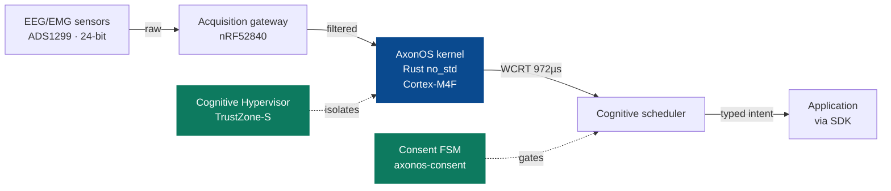

<div align="center">


<br/>
<br/>

# AxonOS

### The open cognitive operating system for brain–computer interfaces.

<br/>

<sub>🇬🇧 [English](./README.md) · 🇯🇵 [日本語](./README.ja.md) · 🇨🇳 [中文](./README.zh.md) · 🇮🇹 [Italiano](./README.it.md) · 🇫🇷 [Français](./README.fr.md) · 🇩🇪 [Deutsch](./README.de.md) · 🇪🇸 [Español](./README.es.md) · 🇸🇦 [العربية](./README.ar.md)</sub>

<br/>

[](https://github.com/AxonOS-org/axonos-standard)
[](https://github.com/AxonOS-org/axonos-kernel)
[](https://github.com/AxonOS-org/axonos-sdk)
[](https://github.com/AxonOS-org/axonos-consent)
[](https://www.rust-lang.org/)
[](#licensing)
[](https://model-checking.github.io/kani/)

<br/>

**[axonos.org](https://axonos.org)** &nbsp;·&nbsp;
**[Specifications](https://axonos.org/specifications.html)** &nbsp;·&nbsp;
**[SDK](https://axonos.org/sdk.html)** &nbsp;·&nbsp;
**[Research](https://axonos.org/research.html)** &nbsp;·&nbsp;
**[Articles](https://medium.com/@AxonOS)** &nbsp;·&nbsp;
**[connect@axonos.org](mailto:connect@axonos.org)**

</div>

---

## What AxonOS is

AxonOS is a hard real-time neural operating system for brain–computer
interfaces. Open-source kernel in `#![no_std]` Rust on ARM Cortex-M.
Formally bounded worst-case response time. Structural privacy that the
application layer cannot bypass.

It is **not** an AI-agent framework, **not** a chatbot runtime, **not** a
generic Python SDK, and **not** a token project. Everything below the
application — the timing guarantees, the neural-permission model, the
consent state machine — is specified, openly licensed, and built to be
independently verified.

> Applications should receive typed, consent-bound intent events —
> never unrestricted raw neural streams.

---

## The four commitments

|  | Commitment | What it means in practice |
|:---:|:---|:---|
| **1** | **Hard real-time on commodity hardware** | `#![no_std]` Rust on ARMv8-M. No GC, no allocator on the hot path, no unbounded panics. Memory safety is structural. |
| **2** | **Formally bounded WCRT** | Every critical-path operation has a Kani-verified upper bound. Latency is *proven*, not benchmarked. |
| **3** | **Structural privacy** | Capabilities that would leak raw cognitive state (`RawEEG`, `EmotionState`, `CognitiveProfile`) do not exist as types. |
| **4** | **Open ecosystem** | Apache-2.0 OR MIT for code, CC-BY-SA-4.0 for specifications. Every repository is public. Anyone can audit, fork, or replace any layer. |

---

## Where to begin

Three honest paths, depending on what you want.

|  | If you want to … | Start here |
|:---:|:---|:---|
| **A** | Get the idea in two minutes | [Concept video](https://axonos.org) · [3-page engineering memo](https://axonos.org/memo.html) |
| **B** | Read the engineering before judging | [`axonos-standard/STANDARD.md`](https://github.com/AxonOS-org/axonos-standard/blob/main/STANDARD.md) · [`axonos-rfcs`](https://github.com/AxonOS-org/axonos-rfcs) |
| **C** | Build against the substrate | [`axonos-sdk`](https://github.com/AxonOS-org/axonos-sdk) · [SDK overview](https://axonos.org/sdk.html) |

---

## The stack

Every repository is public. Source under Apache-2.0 OR MIT, specifications
under CC-BY-SA-4.0. There are no private repositories. Each repository has one
role.

|  | Repository | Role | Language | Latest |
|:---:|:---|:---|:---:|:---|
| ⬢ | [**`axonos-standard`**](https://github.com/AxonOS-org/axonos-standard) | Normative architecture — the canonical technical standard | Markdown | `v1.0.0` |
| ⬢ | [**`axonos-rfcs`**](https://github.com/AxonOS-org/axonos-rfcs) | Design-change process — numbered engineering RFCs, normative once finalised | Markdown | active |
| ⬢ | [**`axonos-kernel`**](https://github.com/AxonOS-org/axonos-kernel) | Execution substrate — hard real-time microkernel, formally bounded WCRT | Rust | `v0.3.0` |
| ⬢ | [**`axonos-sdk`**](https://github.com/AxonOS-org/axonos-sdk) | Application boundary — typed intents, capability manifests, kernel ABI v1 | Rust | `v0.3.5` |
| ⬢ | [**`axonos-sdk-python`**](https://github.com/AxonOS-org/axonos-sdk-python) | Application boundary (Python) — RFC-0006 wire format and capability model, byte-compatible with the Rust SDK | Python | `v0.1.0` |
| ⬢ | [**`axonos-consent`**](https://github.com/AxonOS-org/axonos-consent) | Consent / co-authorisation subsystem — `#![no_std]` reference crate | Rust | `v0.5.0` |
| ⬢ | [**`axonos-validation`**](https://github.com/AxonOS-org/axonos-validation) | Evidence and trace record — measurement traces and reference post-processing | Python | record |
| ⬢ | [**`axon-bci-gateway`**](https://github.com/AxonOS-org/axon-bci-gateway) | Acquisition bridge — OpenBCI fork, MIT preserved from upstream | HTML | active |
| ⬢ | [**`axonos-swarm`**](https://github.com/AxonOS-org/axonos-swarm) | Long-horizon distributed timing — multi-node Neural PTP coordination | Rust | `v0.2.1` |
| ⬢ | [**`AxonOS`**](https://github.com/AxonOS-org/AxonOS) | Public entry point — landing, concept, and links into the stack | — | — |
| ⬢ | [**`become-the-brain-os`**](https://github.com/AxonOS-org/become-the-brain-os) | Community front door — browser game that teaches the runtime, no install | HTML/JS | `v0.3.3` |

<sub>A dedicated wire / conformance repository (`axonos-protocol`) is not yet public; the wire format and conformance suite are currently specified within [`axonos-standard`](https://github.com/AxonOS-org/axonos-standard) and [`axonos-rfcs`](https://github.com/AxonOS-org/axonos-rfcs).</sub>

---

## Architecture


```mermaid
flowchart LR
    A[EEG/EMG sensors<br/>ADS1299 · 24-bit] -->|raw| B[Acquisition gateway<br/>nRF52840]
    B -->|filtered| C[AxonOS kernel<br/>Rust no_std<br/>Cortex-M4F]
    C -->|WCRT 972µs| D[Cognitive scheduler]
    D -->|typed intent| E[Application<br/>via SDK]
    F[Cognitive Hypervisor<br/>TrustZone-S] -.->|isolates| C
    G[Consent FSM<br/>axonos-consent] -.->|gates| D

    classDef kernel fill:#0a4a8f,stroke:#0a4a8f,color:#fff,stroke-width:2px
    classDef secure fill:#0d7a5f,stroke:#0d7a5f,color:#fff,stroke-width:2px
    class C kernel
    class F,G secure
```

Every arrow is a contract. The [Standard](https://github.com/AxonOS-org/axonos-standard)
defines what must hold at each boundary; an implementation is free in
everything else.

---

## By the numbers

<br/>

<table align="center">
<tr>
  <td align="center" width="220">
    <h2>972 µs</h2>
    <sub>Kernel WCRT, measured<br/>STM32F407 @ 168 MHz</sub>
  </td>
  <td align="center" width="220">
    <h2>2.1 µs</h2>
    <sub>Worst-case jitter σ<br/>vs Linux 1323 µs</sub>
  </td>
  <td align="center" width="220">
    <h2>630×</h2>
    <sub>Improvement factor<br/>over Linux mainline</sub>
  </td>
</tr>
<tr>
  <td align="center">
    <h2>30</h2>
    <sub>Kani BMC harnesses<br/>upper bounds proven</sub>
  </td>
  <td align="center">
    <h2>0</h2>
    <sub>Lines of unsafe code<br/>forbidden crate-wide</sub>
  </td>
  <td align="center">
    <h2>42+</h2>
    <sub>Long-form architecture<br/>articles on Medium</sub>
  </td>
</tr>
</table>

<br/>

Each number is traceable to a repository. The evidence taxonomy —
**L1** formally proven, **L2** measured, **L3** independently validated —
is defined in [`VALIDATION.md`](https://github.com/AxonOS-org/axonos-standard/blob/main/VALIDATION.md).
The public stack currently holds L1 and L2 evidence; L3 is not yet claimed.

---

## Quick start

```sh
git clone https://github.com/AxonOS-org/axonos-sdk
cd axonos-sdk
cargo test --features std
```

```rust
use axonos_sdk::{Capability, IntentStream, Manifest};

let manifest = Manifest::builder()
    .app_id("com.example.cursor")?
    .capability(Capability::Navigation)
    .max_rate_hz(50)
    .build()?;

let mut stream = IntentStream::connect(&manifest)?;
while let Some(obs) = stream.try_next()? {
    println!("{:?} @ {} µs ({}%)",
        obs.kind(),
        obs.timestamp().as_micros(),
        obs.confidence_percent());
}
```

The SDK is the Rust reference binding. C FFI, Python, WebAssembly, JNI,
and Swift bindings are on the [published roadmap](https://axonos.org/sdk.html).

---

## Status

| Phase | What | When |
|:---|:---|:---|
| **Phase 0** | Architecture, RFCs, SDK API surface, kernel verification harnesses | Complete |
| **Phase 1** | Clinical-grade 8-channel development kit · ALS centre pilot | Q2 2026 |
| **Phase 2** | FDA 510(k) Q-Sub for the Cognitive Hypervisor · IEEE P2731 contribution | Q3 2026 |
| **Phase 3** | First commercial deployment via Foundation members | 2027 |

---

## What AxonOS does not claim

AxonOS does not currently claim, and this organisation must not be read
as claiming:

- FDA clearance, CE marking, or medical-device approval in any jurisdiction;
- clinical efficacy, or independent clinical validation;
- certified medical-device status, or production-implant readiness;
- complete compliance with IEC 62304, ISO 14971, or ISO 13485.

These are possible future milestones. They are not present facts, and the
project records them as such.

---

## Documentation

- [**Specifications**](https://axonos.org/specifications.html) — kernel ABI v1, capability catalogue, `IntentObservation` wire format, RFC index
- [**SDK and language bindings**](https://axonos.org/sdk.html) — Rust today; C FFI, Python, WebAssembly, JNI, Swift on the published roadmap
- [**Standards engagement**](https://axonos.org/standards.html) — IEEE P2731 · IEC 62304 · ISO 13485 · FDA 510(k) · EU MDR
- [**Governance**](https://axonos.org/governance.html) — current state, transition plan, trademark policy
- [**Engineering memo**](https://axonos.org/memo.html) — three-page summary for technical readers
- [**Long-form articles**](https://medium.com/@AxonOS) — 42+ pieces, one per major architectural decision

---

## Contributing

| Path | Where |
|:---|:---|
| Bugs and feature requests | the relevant repository's Issues tab |
| Specification proposals | pull request to [`axonos-rfcs`](https://github.com/AxonOS-org/axonos-rfcs) |
| Code contributions | [`axonos-sdk/CONTRIBUTING.md`](https://github.com/AxonOS-org/axonos-sdk/blob/main/CONTRIBUTING.md) |
| Security disclosures | [security@axonos.org](mailto:security@axonos.org) · 90-day coordinated disclosure |
| Clinical partnerships | [connect@axonos.org](mailto:connect@axonos.org) |
| General correspondence | [connect@axonos.org](mailto:connect@axonos.org) |

---

## Licensing

| Artefact | License |
|:---|:---|
| Kernel, SDK, consent, swarm, gateway | Apache-2.0 OR MIT |
| RFCs and specifications | CC-BY-SA-4.0 |
| `axon-bci-gateway` | MIT (preserved from upstream OpenBCI_GUI) |

<br/>
<br/>

---

<div align="center">


<br/>
<br/>

**The AxonOS Project**

[axonos.org](https://axonos.org) &nbsp;·&nbsp;
[connect@axonos.org](mailto:connect@axonos.org) &nbsp;·&nbsp;
[LinkedIn](https://www.linkedin.com/in/denis-yermakou) &nbsp;·&nbsp;
[Medium](https://medium.com/@AxonOS)

<sub>Singapore · Zurich · Berlin · Milano · San Mateo</sub>

<br/>

<sub>Built with Rust. Verified with Kani. Aimed at hard real-time.</sub>

</div>
