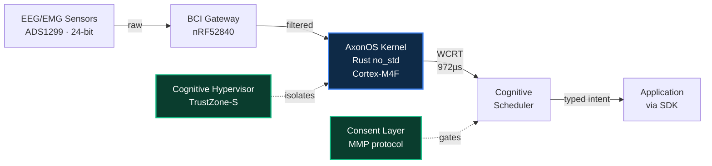

<div align="center">


<br/>

# **axonos**

### The open cognitive operating system for brain-computer interfaces.

<sub>

[English](#english) · [日本語](#日本語) · [中文](#中文) · [Italiano](#italiano) · [Français](#français) · [Deutsch](#deutsch) · [Español](#español) · [العربية](#العربية)

</sub>

<br/>

[](https://medium.com/@AxonOS)
[](https://www.rust-lang.org/)
[](https://github.com/AxonOS-org/axonos-sdk)
[](https://github.com/AxonOS-org/axonos-rfcs)
[](#licensing)
[](https://model-checking.github.io/kani/)

### [🌐 Site](https://axonos.org) · [🔬 Research](https://axonos.org/research) · [📖 Articles](https://medium.com/@AxonOS) · [📐 Specs](https://github.com/AxonOS-org/axonos-rfcs) · [💬 Contact](mailto:connect@axonos.org)

</div>

---

## English

**AxonOS is a hard real-time neural operating system for brain-computer interfaces.** Open-source kernel in `#![no_std]` Rust. Sub-millisecond jitter on commodity ARM Cortex-M. Formally bounded WCRT via Kani BMC. Structural privacy — sensitive capabilities don't exist in the type system, so misuse is a compile error rather than a runtime check.

Built for the patients who depend on closed-loop assistive interfaces, and for the engineers who refuse to ship them on best-effort scheduling.

### Why this exists

Every BCI application today re-parses a bespoke binary wire format per device, re-implements capability gating, and re-writes integration boilerplate for every new hardware platform.

**AxonOS does all three once, in safe `no_std` Rust, on top of a formally-bounded microkernel.** One verifiable substrate. One typed API surface. Many hardware backends.

### The four bets

| | The bet | What it means |
|:---|:---|:---|
| 🦀 | **Hard real-time on commodity hardware** | `#![no_std]` Rust on ARMv8-M. No GC, no allocator on the hot path, no unbounded panics. Memory safety is structural. |
| 📐 | **Formally bounded WCRT** | Every critical-path operation has a Kani-verified upper bound. Latency is *proven*, not benchmarked. |
| 🔒 | **Structural privacy** | Capabilities that would leak raw cognitive state (`RawEEG`, `EmotionState`, `CognitiveProfile`) don't exist as types. Compile-time refusal. |
| 🌐 | **Open ecosystem** | Apache-2.0 OR MIT for code, CC-BY-SA-4.0 for specs. Anyone can read, audit, fork, or replace any layer. |

### Quick start (60 seconds)

```sh
git clone https://github.com/AxonOS-org/axonos-sdk
cd axonos-sdk
cargo test --features std
```

```rust
use axonos_sdk::{Capability, IntentStream, Manifest};

let manifest = Manifest::builder()
    .app_id("com.example.cursor")?
    .capability(Capability::Navigation)
    .max_rate_hz(50)
    .build()?;

let mut stream = IntentStream::connect(&manifest)?;
while let Some(obs) = stream.try_next()? {
    println!("{:?} @ {} µs", obs.kind(), obs.timestamp().as_micros());
}
```

### The ecosystem

| Repository | Purpose | Lang | Status |
|:---|:---|:---:|:---|
| [**axonos-sdk**](https://github.com/AxonOS-org/axonos-sdk) | Application boundary — typed intents, capability manifests, ABI v1 | Rust | `v0.3.4` |
| [**axonos-rfcs**](https://github.com/AxonOS-org/axonos-rfcs) | Engineering specifications | MD | active |
| [**axon-bci-gateway**](https://github.com/AxonOS-org/axon-bci-gateway) | Hardware acquisition gateway (OpenBCI fork) | HTML | active |
| [axonos-kernel](https://github.com/AxonOS-org/AxonOS-kernel) | Hard real-time microkernel — 7 crates, 66 tests, 28 Kani harnesses | Rust | private |
| [axonos-consent](https://github.com/AxonOS-org/axonos-consent) | Protocol-level consent for cognitive mesh coupling (MMP) | Rust | private |
| [axonos-swarm](https://github.com/AxonOS-org/axonos-swarm) | Multi-node coordination — Neural PTP, swarm scheduling | Rust | private |

> Core kernel sources, consent runtime, and swarm coordinator are maintained in private repositories until the Phase-1 clinical preprint.

### Architecture


```mermaid
flowchart LR
    A[EEG/EMG Sensors<br/>ADS1299 · 24-bit] -->|raw| B[BCI Gateway<br/>nRF52840]
    B -->|filtered| C[AxonOS Kernel<br/>Rust no_std<br/>Cortex-M4F]
    C -->|WCRT<br/>972µs| D[Cognitive<br/>Scheduler]
    D -->|typed intent| E[Application<br/>via SDK]
    F[Cognitive Hypervisor<br/>TrustZone-S] -.->|isolates| C
    G[Consent Layer<br/>MMP protocol] -.->|gates| D

    classDef kernel fill:#0e2a47,stroke:#3b82f6,color:#fff,stroke-width:2px
    classDef secure fill:#0a3d2e,stroke:#10b981,color:#fff,stroke-width:2px
    class C kernel
    class F,G secure
```

### By the numbers

| Metric | Value |
|:---|---:|
| Kernel WCRT, measured on STM32F407 | **972 µs** |
| Worst-case jitter σ (AxonOS) | **2.1 µs** |
| Worst-case jitter σ (Linux mainline) | 1323 µs |
| Improvement factor vs Linux mainline | **630×** |
| Production crates in kernel workspace | **7** |
| Kani Bounded Model Checking harnesses | **28** |
| Unit and integration tests | **66+** |
| Long-form architecture articles published | **42+** |
| Years of engineering invested | **2+** |

### Status

| Phase | What | When |
|:---|:---|:---:|
| **Phase 0** | Architecture, RFCs, SDK API surface, Kernel verification harnesses | ✓ Done |
| **Phase 1** | Clinical-grade 8-channel dev kit · ALS center clinical pilot | 🟡 Q2 2026 |
| **Phase 2** | FDA 510(k) Q-Sub for Cognitive Hypervisor · IEEE P2731 contribution | 🔵 Q3 2026 |
| **Phase 3** | First commercial deployment via Foundation members | 🔵 2027 |

### Documentation

- [Long-form architecture series on Medium](https://medium.com/@AxonOS) — 42+ articles, one per major decision
- [Project website with research overview](https://axonos.org/research)
- [Engineering specifications (RFCs)](https://github.com/AxonOS-org/axonos-rfcs)
- [SDK reference docs](https://docs.rs/axonos-sdk) (after first crates.io publish)

### Contributing

| Path | Where |
|:---|:---|
| Bugs and feature requests | the relevant repository's Issues tab |
| Specification proposals | pull request to [axonos-rfcs](https://github.com/AxonOS-org/axonos-rfcs) |
| Code | [axonos-sdk CONTRIBUTING.md](https://github.com/AxonOS-org/axonos-sdk/blob/main/CONTRIBUTING.md) |
| Security disclosures | [security@axonos.org](mailto:security@axonos.org) |
| Clinical partnerships | [connect@axonos.org](mailto:connect@axonos.org) |
| Press, speaking, general | [info@axonos.org](mailto:info@axonos.org) |

### Licensing

| Artifact | License |
|:---|:---|
| Kernel, SDK, consent, swarm | Apache-2.0 OR MIT |
| RFCs and specifications | CC-BY-SA-4.0 |
| `axon-bci-gateway` | MIT (preserved from upstream OpenBCI_GUI) |

---

<details>
<summary><b>日本語 · Japanese</b></summary>

<a name="日本語"></a>

### **AxonOS — AI とブレイン・コンピュータ・インターフェースを橋渡しする認知オペレーティングシステム**

`#![no_std]` Rust で書かれたオープンソースカーネル。汎用 ARM Cortex-M 上でサブミリ秒のジッタを実現。Kani 有界モデル検査による WCRT の形式的境界保証。**構造的プライバシー** — センシティブな機能は型システムに存在しないため、誤用はランタイムチェックではなくコンパイルエラーになります。

クローズドループ補助インターフェースに依存する患者のため、そしてベストエフォートスケジューリングで製品を出荷することを拒否するエンジニアのために構築。

#### なぜ AxonOS が必要か

今日、すべての BCI アプリケーションはデバイスごとに独自のバイナリワイヤーフォーマットを再解析し、機能ゲーティングを再実装し、新しいハードウェアプラットフォームごとに統合コードを書き直さなければなりません。

**AxonOS は、形式的に境界づけられたマイクロカーネル上で、安全な `no_std` Rust によりこれら 3 つを一度に行います。** 1 つの検証可能な基盤。1 つの型付き API。多数のハードウェアバックエンド。

#### 4 つの技術的な賭け

| | 賭け | 意味 |
|:---|:---|:---|
| 🦀 | **汎用ハードウェアでのハードリアルタイム** | ARMv8-M 上の `#![no_std]` Rust。GC なし、ホットパスにアロケータなし、無制限のパニックなし。 |
| 📐 | **形式的に境界づけられた WCRT** | すべてのクリティカルパス操作には Kani 検証済みの上限があります。レイテンシは測定されるのではなく*証明*されます。 |
| 🔒 | **構造的プライバシー** | 生の認知状態を漏洩する機能(`RawEEG`、`EmotionState`)は型として存在しません。コンパイル時の拒否。 |
| 🌐 | **オープンエコシステム** | コードは Apache-2.0 または MIT、仕様は CC-BY-SA-4.0。誰でも監査・フォーク・置き換え可能。 |

#### ステータス

| フェーズ | 内容 | 時期 |
|:---|:---|:---:|
| **フェーズ 0** | アーキテクチャ、RFC、SDK API、カーネル検証 | ✓ 完了 |
| **フェーズ 1** | 臨床グレード 8ch 開発キット · ALS センター臨床試験 | 🟡 2026 Q2 |
| **フェーズ 2** | FDA 510(k) Q-Sub · IEEE P2731 寄稿 | 🔵 2026 Q3 |
| **フェーズ 3** | 初の商用展開 | 🔵 2027 |

</details>

<details>
<summary><b>中文 · Chinese (Simplified)</b></summary>

<a name="中文"></a>

### **AxonOS — 桥接人工智能与脑机接口的认知操作系统**

开源内核,使用 `#![no_std]` Rust 编写。在普通 ARM Cortex-M 上实现亚毫秒级抖动。通过 Kani 有界模型检查 (BMC) 形式化验证最坏情况响应时间。**结构化隐私** — 敏感能力在类型系统中根本不存在,因此误用会在编译时被拒绝,而非运行时检查。

为依赖闭环辅助接口的患者而构建,为拒绝在"尽力而为"调度上交付产品的工程师而构建。

#### 为什么需要 AxonOS

当今每一个脑机接口应用都必须为每种设备重新解析专有的二进制格式、重新实现能力门控、并为每一种新硬件平台重新编写集成代码。

**AxonOS 在形式化验证的微内核之上,用安全的 `no_std` Rust 一次性完成这三件事。** 一个可验证的基础。一个类型化的 API 表面。支持多种硬件后端。

#### 四大技术押注

| | 押注 | 含义 |
|:---|:---|:---|
| 🦀 | **普通硬件上的硬实时** | ARMv8-M 上的 `#![no_std]` Rust。无 GC、热路径无分配器、无无界 panic。 |
| 📐 | **形式化验证的 WCRT** | 每个关键路径操作都有 Kani 验证的上界。延迟是被*证明*的,而非被测量的。 |
| 🔒 | **结构化隐私** | 会泄露原始认知状态的能力(`RawEEG`、`EmotionState`)在类型系统中不存在。编译期拒绝。 |
| 🌐 | **开放生态** | 代码采用 Apache-2.0 或 MIT 许可,规范采用 CC-BY-SA-4.0。任何人都可以审计、分叉、或替换任何层。 |

#### 状态

| 阶段 | 内容 | 时间 |
|:---|:---|:---:|
| **阶段 0** | 架构、RFCs、SDK API、内核验证 | ✓ 完成 |
| **阶段 1** | 临床级 8 通道开发套件 · ALS 中心临床试点 | 🟡 2026 Q2 |
| **阶段 2** | FDA 510(k) Q-Sub · IEEE P2731 贡献 | 🔵 2026 Q3 |
| **阶段 3** | 首个商业部署 | 🔵 2027 |

</details>

<details>
<summary><b>Italiano · Italian</b></summary>

<a name="italiano"></a>

### **AxonOS — il sistema operativo cognitivo open che collega l'IA alle interfacce cervello-computer**

Kernel open-source scritto in `#![no_std]` Rust. Jitter sotto il millisecondo su ARM Cortex-M commerciale. Limiti superiori del WCRT verificati formalmente tramite Kani Bounded Model Checking. **Privacy strutturale** — le capability sensibili non esistono nel sistema dei tipi, quindi l'uso improprio è un errore di compilazione, non un controllo a runtime.

Costruito per i pazienti che dipendono da interfacce assistive a ciclo chiuso, e per gli ingegneri che si rifiutano di rilasciarle su scheduling best-effort.

#### Perché AxonOS esiste

Oggi ogni applicazione BCI deve ri-analizzare un formato binario proprietario per ciascun dispositivo, ri-implementare il gating delle capability, e riscrivere il codice di integrazione per ogni nuova piattaforma hardware.

**AxonOS fa tutte e tre le cose una volta sola, in `no_std` Rust sicuro, sopra un microkernel formalmente vincolato.** Una base verificabile. Una superficie API tipata. Molti backend hardware.

#### Le quattro scommesse

| | La scommessa | Cosa significa |
|:---|:---|:---|
| 🦀 | **Hard real-time su hardware commerciale** | Rust `#![no_std]` su ARMv8-M. Niente GC, niente allocator nel percorso critico, niente panic illimitati. |
| 📐 | **WCRT formalmente vincolato** | Ogni operazione del percorso critico ha un limite superiore verificato da Kani. La latenza è *dimostrata*, non misurata. |
| 🔒 | **Privacy strutturale** | Le capability che farebbero trapelare stato cognitivo grezzo non esistono come tipi. Rifiuto in fase di compilazione. |
| 🌐 | **Ecosistema aperto** | Apache-2.0 OR MIT per il codice, CC-BY-SA-4.0 per le specifiche. Chiunque può fare audit, fork o sostituire qualsiasi strato. |

#### Stato

| Fase | Contenuto | Quando |
|:---|:---|:---:|
| **Fase 0** | Architettura, RFC, API dell'SDK, verifica del kernel | ✓ Completato |
| **Fase 1** | Kit di sviluppo clinico (8 canali) · pilota presso centro ALS | 🟡 Q2 2026 |
| **Fase 2** | FDA 510(k) Q-Sub per Cognitive Hypervisor · contributo IEEE P2731 | 🔵 Q3 2026 |
| **Fase 3** | Primo deployment commerciale | 🔵 2027 |

</details>

<details>
<summary><b>Français · French</b></summary>

<a name="français"></a>

### **AxonOS — le système d'exploitation cognitif open source qui relie l'IA aux interfaces cerveau-ordinateur**

Noyau open-source en `#![no_std]` Rust. Gigue inférieure à la milliseconde sur ARM Cortex-M grand public. Bornes supérieures du WCRT vérifiées formellement via Kani Bounded Model Checking. **Confidentialité structurelle** — les capacités sensibles n'existent pas dans le système de types, l'usage abusif est donc une erreur de compilation, pas une vérification d'exécution.

Conçu pour les patients qui dépendent d'interfaces assistives en boucle fermée, et pour les ingénieurs qui refusent de les livrer sur du best-effort scheduling.

#### Pourquoi AxonOS existe

Aujourd'hui, chaque application BCI doit re-parser un format binaire propriétaire par appareil, ré-implémenter le contrôle de capacités, et réécrire le code d'intégration pour chaque nouvelle plateforme matérielle.

**AxonOS fait les trois en une seule fois, en Rust `no_std` sûr, au-dessus d'un microkernel formellement borné.** Une seule base vérifiable. Une seule surface d'API typée. De nombreux backends matériels.

#### Les quatre paris

| | Le pari | Ce que cela signifie |
|:---|:---|:---|
| 🦀 | **Temps réel strict sur matériel commercial** | Rust `#![no_std]` sur ARMv8-M. Pas de GC, pas d'allocateur sur le chemin critique, pas de panics illimités. |
| 📐 | **WCRT formellement borné** | Chaque opération du chemin critique a une borne supérieure vérifiée par Kani. La latence est *prouvée*, pas mesurée. |
| 🔒 | **Confidentialité structurelle** | Les capacités qui feraient fuir l'état cognitif brut n'existent pas en tant que types. Refus à la compilation. |
| 🌐 | **Écosystème ouvert** | Apache-2.0 OR MIT pour le code, CC-BY-SA-4.0 pour les spécifications. Chaque couche est auditable, forkable, remplaçable. |

#### Statut

| Phase | Contenu | Échéance |
|:---|:---|:---:|
| **Phase 0** | Architecture, RFC, API du SDK, vérification du noyau | ✓ Terminé |
| **Phase 1** | Kit de développement clinique (8 canaux) · pilote au centre ALS | 🟡 Q2 2026 |
| **Phase 2** | FDA 510(k) Q-Sub pour Cognitive Hypervisor · contribution IEEE P2731 | 🔵 Q3 2026 |
| **Phase 3** | Premier déploiement commercial | 🔵 2027 |

</details>

<details>
<summary><b>Deutsch · German</b></summary>

<a name="deutsch"></a>

### **AxonOS — das offene kognitive Betriebssystem als Brücke zwischen KI und Gehirn-Computer-Schnittstellen**

Open-Source-Kernel in `#![no_std]` Rust. Sub-Millisekunden-Jitter auf handelsüblichen ARM Cortex-M. Formal verifizierte WCRT-Obergrenzen via Kani Bounded Model Checking. **Strukturelle Privatsphäre** — sensible Capabilities existieren nicht im Typsystem, sodass Missbrauch zur Compile-Zeit abgelehnt wird, nicht zur Laufzeit.

Gebaut für Patienten, die auf closed-loop-Assistenzschnittstellen angewiesen sind, und für Ingenieure, die sich weigern, sie auf Best-Effort-Scheduling auszuliefern.

#### Warum AxonOS existiert

Heute muss jede BCI-Anwendung pro Gerät ein eigenes binäres Wire-Format neu parsen, Capability-Gating neu implementieren und Integrations-Boilerplate für jede neue Hardware-Plattform neu schreiben.

**AxonOS erledigt alle drei Aufgaben einmalig in sicherem `no_std` Rust auf einem formal beschränkten Mikrokernel.** Eine verifizierbare Basis. Eine typisierte API-Oberfläche. Viele Hardware-Backends.

#### Die vier strategischen Wetten

| | Wette | Bedeutung |
|:---|:---|:---|
| 🦀 | **Harter Echtzeitbetrieb auf Standardhardware** | `#![no_std]` Rust auf ARMv8-M. Kein GC, kein Allokator im Hot Path, keine unbeschränkten Panics. |
| 📐 | **Formal beschränkte WCRT** | Jede Critical-Path-Operation hat eine Kani-verifizierte Obergrenze. Latenz wird nicht gemessen, sondern *bewiesen*. |
| 🔒 | **Strukturelle Privatsphäre** | Capabilities, die rohe kognitive Daten leaken würden, existieren nicht als Typen. Compile-Time-Refusal. |
| 🌐 | **Offenes Ökosystem** | Apache-2.0 OR MIT für Code, CC-BY-SA-4.0 für Spezifikationen. Jede Schicht ist auditierbar, forkbar, austauschbar. |

#### Status

| Phase | Inhalt | Zeitpunkt |
|:---|:---|:---:|
| **Phase 0** | Architektur, RFCs, SDK-API, Kernel-Verifikation | ✓ Abgeschlossen |
| **Phase 1** | Klinik-Dev-Kit (8 Kanäle) · ALS-Zentrum-Pilot | 🟡 Q2 2026 |
| **Phase 2** | FDA 510(k) Q-Sub für Cognitive Hypervisor · IEEE P2731 | 🔵 Q3 2026 |
| **Phase 3** | Erste kommerzielle Bereitstellung | 🔵 2027 |

</details>

<details>
<summary><b>Español · Spanish</b></summary>

<a name="español"></a>

### **AxonOS — el sistema operativo cognitivo abierto que conecta la IA con las interfaces cerebro-computadora**

Kernel de código abierto en `#![no_std]` Rust. Jitter sub-milisegundo en ARM Cortex-M comercial. Límites superiores de WCRT verificados formalmente mediante Kani Bounded Model Checking. **Privacidad estructural** — las capacidades sensibles no existen en el sistema de tipos, por lo que el uso indebido es rechazado en tiempo de compilación, no comprobado en tiempo de ejecución.

Construido para los pacientes que dependen de interfaces asistivas de bucle cerrado, y para los ingenieros que se niegan a entregarlos sobre planificación best-effort.

#### Por qué existe AxonOS

Hoy, cada aplicación BCI debe reparsear un formato binario propio por dispositivo, reimplementar el control de capacidades, y reescribir el código de integración para cada nueva plataforma de hardware.

**AxonOS hace las tres cosas una sola vez, en `no_std` Rust seguro, sobre un microkernel formalmente acotado.** Una base verificable. Una superficie API tipada. Múltiples backends de hardware.

#### Las cuatro apuestas

| | Apuesta | Significado |
|:---|:---|:---|
| 🦀 | **Tiempo real estricto en hardware comercial** | Rust `#![no_std]` en ARMv8-M. Sin GC, sin asignador en el camino caliente, sin panics no acotados. |
| 📐 | **WCRT formalmente acotado** | Cada operación crítica tiene un límite superior verificado por Kani. La latencia se *demuestra*, no se mide. |
| 🔒 | **Privacidad estructural** | Las capacidades que filtrarían estado cognitivo crudo no existen como tipos. Rechazo en tiempo de compilación. |
| 🌐 | **Ecosistema abierto** | Apache-2.0 OR MIT para código, CC-BY-SA-4.0 para especificaciones. Cualquiera puede auditar, bifurcar o reemplazar cualquier capa. |

#### Estado

| Fase | Contenido | Cuándo |
|:---|:---|:---:|
| **Fase 0** | Arquitectura, RFCs, API del SDK, verificación del kernel | ✓ Completado |
| **Fase 1** | Kit de desarrollo clínico (8 canales) · piloto en centro ALS | 🟡 Q2 2026 |
| **Fase 2** | FDA 510(k) Q-Sub para Cognitive Hypervisor · IEEE P2731 | 🔵 Q3 2026 |
| **Fase 3** | Primera implementación comercial | 🔵 2027 |

</details>

<details>
<summary><b>العربية · Arabic</b></summary>

<a name="العربية"></a>

<div dir="rtl" align="right">

### **AxonOS — نظام التشغيل المعرفي مفتوح المصدر الذي يربط الذكاء الاصطناعي بواجهات الدماغ والحاسوب**

نواة مفتوحة المصدر مكتوبة بلغة `#![no_std]` Rust. اضطراب زمني أقل من ميلي ثانية على معالجات ARM Cortex-M التجارية. حدود عليا لزمن الاستجابة في أسوأ الحالات (WCRT) مُتحقق منها رسمياً عبر Kani Bounded Model Checking. **خصوصية بنيوية** — الصلاحيات الحساسة غير موجودة في نظام الأنواع، لذا فإن الاستخدام الخاطئ هو خطأ في وقت الترجمة وليس فحصاً في وقت التشغيل.

تم بناؤه من أجل المرضى الذين يعتمدون على واجهات مساعدة ذات حلقة مغلقة، ومن أجل المهندسين الذين يرفضون شحنها بجدولة "أفضل جهد ممكن".

#### لماذا يوجد AxonOS

اليوم، يجب على كل تطبيق لواجهة الدماغ والحاسوب أن يعيد تحليل تنسيق ثنائي خاص لكل جهاز، وأن يعيد تنفيذ آلية بوابات الصلاحيات، وأن يعيد كتابة الشيفرة التكاملية لكل منصة عتاد جديدة.

**يقوم AxonOS بهذه المهام الثلاث مرة واحدة، بلغة `no_std` Rust الآمنة، فوق نواة مصغرة محدودة رسمياً.** أساس واحد قابل للتحقق. سطح واجهة برمجية واحد بأنواع محددة. واجهات خلفية عتادية متعددة.

#### الرهانات الأربعة

| | الرهان | ماذا يعني |
|:---|:---|:---|
| 🦀 | **زمن حقيقي صارم على عتاد تجاري** | Rust `#![no_std]` على ARMv8-M. لا جامع قمامة، لا مُخصِّص ذاكرة في المسار الحرج، لا حالات panic غير محدودة. |
| 📐 | **WCRT محدود رسمياً** | كل عملية في المسار الحرج لها حد أعلى مُتحقَّق منه بواسطة Kani. زمن الاستجابة *مُبرهَن* وليس مُقاساً. |
| 🔒 | **خصوصية بنيوية** | الصلاحيات التي قد تكشف الحالة المعرفية الخام (`RawEEG`، `EmotionState`) غير موجودة كأنواع. رفض في وقت الترجمة. |
| 🌐 | **منظومة مفتوحة** | Apache-2.0 أو MIT للشيفرة، CC-BY-SA-4.0 للمواصفات. يمكن لأي شخص تدقيق أو نسخ أو استبدال أي طبقة. |

#### الحالة

| المرحلة | المحتوى | الموعد |
|:---|:---|:---:|
| **المرحلة 0** | البنية المعمارية، RFCs، واجهة SDK، تحقق النواة | ✓ مكتمل |
| **المرحلة 1** | عُدة تطوير سريرية (8 قنوات) · تجربة في مركز ALS | 🟡 الربع الثاني 2026 |
| **المرحلة 2** | FDA 510(k) Q-Sub لـ Cognitive Hypervisor · مساهمة في IEEE P2731 | 🔵 الربع الثالث 2026 |
| **المرحلة 3** | أول نشر تجاري | 🔵 2027 |

</div>

</details>

---

<div align="center">


<br/>

**Built and maintained by Denis Yermakou**

[denis@axonos.org](mailto:denis@axonos.org) · [LinkedIn](https://www.linkedin.com/in/denis-yermakou) · [Medium](https://medium.com/@AxonOS)

Singapore · Zurich · Berlin · Milano · San Mateo

<br/>

<sub>Built with Rust. Verified with Kani. Aimed at hard real-time.</sub>

<sub><i>The kernel is how we earn the right to see real brain signals.</i></sub>

</div>
