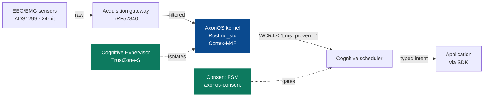

[](/AxonOS-org/.github/blob/main/profile/banner.jpg)

# AxonOS

### The open cognitive operating system for brain–computer interfaces.

🇬🇧 [English](https://github.com/AxonOS-org/.github/blob/main/profile/README.md) · 🇯🇵 [日本語](https://github.com/AxonOS-org/.github/blob/main/profile/README.ja.md) · 🇨🇳 [中文](https://github.com/AxonOS-org/.github/blob/main/profile/README.zh.md) · 🇮🇹 [Italiano](https://github.com/AxonOS-org/.github/blob/main/profile/README.it.md) · 🇫🇷 [Français](https://github.com/AxonOS-org/.github/blob/main/profile/README.fr.md) · 🇩🇪 [Deutsch](https://github.com/AxonOS-org/.github/blob/main/profile/README.de.md) · 🇪🇸 [Español](https://github.com/AxonOS-org/.github/blob/main/profile/README.es.md) · 🇸🇦 [العربية](https://github.com/AxonOS-org/.github/blob/main/profile/README.ar.md)

[](https://github.com/AxonOS-org/axonos-standard/releases) [](https://github.com/AxonOS-org/axonos-kernel/releases) [](https://github.com/AxonOS-org/axonos-consent/releases) [](https://github.com/AxonOS-org/axonos-protocol/releases) [](https://www.rust-lang.org/) [](#licensing) [](https://model-checking.github.io/kani/) [](https://axonos-bci.github.io/axonos-community-radar/)

**[axonos.org](https://axonos.org)** · **[Specifications](https://axonos.org/specifications.html)** · **[SDK](https://axonos.org/sdk.html)** · **[Research](https://axonos.org/research.html)** · **[Articles](https://medium.com/@AxonOS)** · **<connect@axonos.org>**

---

## What AxonOS is

AxonOS is a hard real-time neural operating system for brain–computer
interfaces. Open-source kernel in `#![no_std]` Rust on ARM Cortex-M.
Formally bounded worst-case response time. Structural privacy that the
application layer cannot bypass.

It is **not** an AI-agent framework, **not** a chatbot runtime, **not** a
generic Python SDK, and **not** a token project. Everything below the
application — the timing guarantees, the neural-permission model, the
consent state machine — is specified, openly licensed, and built to be
independently verified.

> Applications should receive typed, consent-bound intent events —
> never unrestricted raw neural streams.

---

## See it work — and verify it yourself

Nothing here asks for trust. Every claim is runnable in **one click** or **three commands**, and each prints a pass/fail you can check.

**One click**

- ▶ **Play it** — [**Neural Boundary Game**](https://axonos.org/neural-boundary-game.html): the consent, least-privilege, sealed-vault and StimGuard model, live in the browser on the same deterministic core the kernel uses. Every run emits a byte-for-byte replayable proof.
- 📄 **Read the analysis** — [**Zenodo preprint**](https://doi.org/10.5281/zenodo.20552007) (DOI `10.5281/zenodo.20552007`): EDF schedulability (R1 = 972 µs inside a 4 ms deadline), capability isolation, falsifiable predictions — *predicted from datasheet cycle counts, no measurement claims*.

**Three commands** — clone and run; each is reproducible on any machine

```sh
# 1 · the full path, electrode -> typed intent, verified bit-for-bit
git clone https://github.com/AxonOS-org/axonos-e2e-demo && cd axonos-e2e-demo && ./run.sh --verify

# 2 · the kernel: 72 tests, then a machine-checked proof
git clone https://github.com/AxonOS-org/axonos-kernel && cd axonos-kernel
cargo test --workspace
cargo kani setup && ( cd axonos-spsc/kani-proofs && cargo kani )

# 3 · the DSP + classifier machinery, bit-exact against conformance vectors
git clone https://github.com/AxonOS-org/axonos-signal-pipeline && cd axonos-signal-pipeline && cargo test
```

One wire format, **five languages, byte-identical** — [`axonos-conformance`](https://github.com/AxonOS-org/axonos-conformance) re-checks Rust = Python = C = JavaScript = Java in CI on every push.

> What you are checking: the proofs are machine-checked (**L1**); the demos are deterministic and reproducible; the on-hardware worst-case numbers (**L2**) are **not yet claimed** — their status is tracked, claim by claim, in [`CLAIMS.md`](https://github.com/AxonOS-org/axonos-standard/blob/main/CLAIMS.md).

---

## 📡 The open BCI field — live

<!-- RADAR:START -->
The **AxonOS Community Radar** continuously maps every open-source brain–computer-interface
project, tool and team building in the open — AxonOS included, ranked by the same public-signal
formula as everyone else, with no boosting.

<p align="center"><a href="https://axonos-bci.github.io/axonos-community-radar/report.html"><b>📊 The State of Open BCI — read the full report →</b></a></p>

<p align="center">     </p>

<sub>One click for the exhaustive view — a Gartner-style reach×engagement quadrant, category and evidence breakdowns, and a full table of all 120 tracked resources. Currently leading by reach: `tensorflow` · `pytorch` · `annotated_deep_learning_paper_implementations` · `keras`. Auto-refreshed from the radar every 3 hours · last update <b>10 Jul 2026, 10:04 UTC</b>.</sub>
<!-- RADAR:END -->

---

## The four commitments

|       | Commitment                               | What it means in practice                                                                                                              |
| ----- | ---------------------------------------- | -------------------------------------------------------------------------------------------------------------------------------------- |
| **1** | **Hard real-time on commodity hardware** | `#![no_std]` Rust on ARMv8-M. No GC, no allocator on the hot path, no unbounded panics. Memory safety is structural.                   |
| **2** | **Formally bounded WCRT**                | Every critical-path operation has a Kani-verified upper bound. Latency is *proven*, not benchmarked.                                   |
| **3** | **Structural privacy**                   | Capabilities that would leak raw cognitive state (`RawEEG`, `EmotionState`, `CognitiveProfile`) do not exist as types.                 |
| **4** | **Open ecosystem**                       | Apache-2.0 OR MIT for code, CC-BY-SA-4.0 for specifications. Every repository is public. Anyone can audit, fork, or replace any layer. |

---

The consent layer's proof files read like the promises they keep — [`fsm_no_invalid_transitions.rs`](https://github.com/AxonOS-org/axonos-consent/blob/main/kani/fsm_no_invalid_transitions.rs) · [`handle_withdraw_terminates.rs`](https://github.com/AxonOS-org/axonos-consent/blob/main/kani/handle_withdraw_terminates.rs) · [`co_authorisation_requires_two_parties.rs`](https://github.com/AxonOS-org/axonos-consent/blob/main/kani/co_authorisation_requires_two_parties.rs) · [`signature_verification_constant_time.rs`](https://github.com/AxonOS-org/axonos-consent/blob/main/kani/signature_verification_constant_time.rs) · [`cbor_decoder_bounded.rs`](https://github.com/AxonOS-org/axonos-consent/blob/main/kani/cbor_decoder_bounded.rs) — five machine-checked Kani harnesses; the kernel's thirty are re-proved at every [release gate](https://github.com/AxonOS-org/axonos-kernel/blob/main/.github/workflows/release-gate.yml).

---

## Where to begin

Three honest paths, depending on what you want.

|       | If you want to …                    | Start here                                                                                                                                                        |
| ----- | ----------------------------------- | ----------------------------------------------------------------------------------------------------------------------------------------------------------------- |
| **A** | Get the idea in two minutes         | [Concept](https://axonos.org) · [**Play the Neural Boundary Game**](https://axonos.org/neural-boundary-game.html) · [3-page engineering memo](https://axonos.org/memo.html) |
| **B** | Read the engineering before judging | [`axonos-standard/STANDARD.md`](https://github.com/AxonOS-org/axonos-standard/blob/main/STANDARD.md) · [`axonos-rfcs`](https://github.com/AxonOS-org/axonos-rfcs) |
| **C** | Build against the substrate         | [`axonos-sdk`](https://github.com/AxonOS-org/axonos-sdk) · [SDK overview](https://axonos.org/sdk.html)                                                            |

---

## The stack

Every repository is public. Source under Apache-2.0 OR MIT, specifications
under CC-BY-SA-4.0. There are no private repositories. Each repository has one
role.

|   | Repository                                                                     | Role                                                                                                                                              | Language | Latest                                                                                                                                       |
| --- | ------------------------------------------------------------------------------ | ----------------------------------------------------------------------------------------------------------------------------------------------- | -------- | ------------------------------------------------------------------------------------------------------------------------------------------ |
| ⬢ | [**`axonos-standard`**](https://github.com/AxonOS-org/axonos-standard)         | Normative architecture — the canonical technical standard                                                                                         | Markdown | [](https://github.com/AxonOS-org/axonos-standard/releases) |
| ⬢ | [**`axonos-rfcs`**](https://github.com/AxonOS-org/axonos-rfcs)                 | Design-change process — numbered engineering RFCs, normative once finalised                                                                       | Markdown | active                                                                                                                                       |
| ⬢ | [**`axonos-kernel`**](https://github.com/AxonOS-org/axonos-kernel)             | Execution substrate — hard real-time microkernel, formally bounded WCRT                                                                           | Rust     | [](https://github.com/AxonOS-org/axonos-kernel/releases) |
| ⬢ | [**`axonos-sdk`**](https://github.com/AxonOS-org/axonos-sdk)                   | Application boundary — typed intents, capability manifests, kernel ABI v1                                                                         | Rust     | [](https://github.com/AxonOS-org/axonos-sdk/releases) |
| ⬢ | [**`axonos-sdk-python`**](https://github.com/AxonOS-org/axonos-sdk-python)     | Application boundary (Python) — RFC-0006 wire format, byte-compatible with the Rust SDK                                                           | Python   | [](https://github.com/AxonOS-org/axonos-sdk-python/releases) |
| ⬢ | [**`axonos-consent`**](https://github.com/AxonOS-org/axonos-consent)           | Consent / co-authorisation subsystem — `#![no_std]` reference crate                                                                               | Rust     | [](https://github.com/AxonOS-org/axonos-consent/releases) |
| ⬢ | [**`axonos-protocol`**](https://github.com/AxonOS-org/axonos-protocol)         | Network-level consent protocol — `no_std`, zero-alloc, bounded CBOR frames and an exhaustive consent state machine                                | Rust     | [](https://github.com/AxonOS-org/axonos-protocol/releases) |
| ⬢ | [**`axonos-conformance`**](https://github.com/AxonOS-org/axonos-conformance)   | Byte-exact conformance — RFC-0005 capability manifest & RFC-0006 intent wire format, cross-checked across Rust, Python, C, JavaScript, Java in CI | multi    | active                                                                                                                                       |
| ⬢ | [**`axonos-signal-pipeline`**](https://github.com/AxonOS-org/axonos-signal-pipeline) | Signal pipeline — fixed-point DSP filter bank, features, MDM/LDA classifier inference, calibration; vector-pinned, no trained model | Rust | [](https://github.com/AxonOS-org/axonos-signal-pipeline/releases) |
| ⬢ | [**`axonos-e2e-demo`**](https://github.com/AxonOS-org/axonos-e2e-demo) | End-to-end reference — synthetic signal -> typed consent-bound intent, verified bit-for-bit on every run | Python | active |
| ⬢ | [**`axonos-validation`**](https://github.com/AxonOS-org/axonos-validation)     | Evidence and trace record — measurement traces and reference post-processing                                                                      | Python   | record                                                                                                                                       |
| ⬢ | [**`axon-bci-gateway`**](https://github.com/AxonOS-org/axon-bci-gateway)       | Acquisition bridge — OpenBCI fork, MIT preserved from upstream                                                                                    | HTML     | [](https://github.com/AxonOS-org/axon-bci-gateway/releases) |
| ⬢ | [**`axonos-swarm`**](https://github.com/AxonOS-org/axonos-swarm)               | Long-horizon distributed timing — multi-node Neural PTP coordination                                                                              | Rust     | [](https://github.com/AxonOS-org/axonos-swarm/releases) |
| ⬢ | [**`AxonOS`**](https://github.com/AxonOS-org/AxonOS)                           | Public entry point — landing, concept, and links into the stack                                                                                   | —        | —                                                                                                                                           |
| ⬢ | [**`become-the-brain-os`**](https://github.com/AxonOS-org/become-the-brain-os) | Community front door — browser game that teaches the runtime, no install                                                                          | HTML/JS  | [](https://github.com/AxonOS-org/become-the-brain-os/releases) |
| ⬢ | [**`neural-boundary-game`**](https://github.com/AxonOS-BCI/neural-boundary-game) | Interactive demo — deterministic Rust/WASM model of the sovereignty architecture (consent, least-privilege scopes, sealed vault, StimGuard), playable in-browser, byte-for-byte replayable | Rust/WASM | [](https://github.com/AxonOS-BCI/neural-boundary-game/releases) |

> `neural-boundary-game` lives in the **AxonOS-BCI** org and ships under
> **AGPL-3.0-only OR AxonOS Commercial** — it is the application-layer demo, not
> part of the permissive Apache/MIT core.

---

## The full path: electrode to intent

A complete brain–computer interface operating system is a continuous chain — from
a raw electrode signal to a typed, consented intent, and back to a safe failure
state. AxonOS is building that chain in the open. This map is deliberately honest
about what is shipped, what is partial, and what is still ahead.

| Stage                                          | Provided by                                      | Status                         |
| ---------------------------------------------- | ------------------------------------------------ | ------------------------------ |
| Electrode acquisition / ADC bridge             | `axon-bci-gateway` (OpenBCI)                     | **partial**                    |
| Monotonic timestamping                         | `axonos-kernel`                                  | **live**                       |
| Deterministic handoff — SPSC IPC, ring buffers | `axonos-kernel`                                  | **live**                       |
| Signal conditioning — fixed-point IIR bank (DC blocker · notch · band-pass) | [`axonos-signal-pipeline`](https://github.com/AxonOS-org/axonos-signal-pipeline) | **live** *(machinery, vector-pinned)* |
| Feature extraction & classifier inference (MDM / LDA) | [`axonos-signal-pipeline`](https://github.com/AxonOS-org/axonos-signal-pipeline) | **live** *(no trained model yet)* |
| Typed intent ABI — RFC-0006                    | `axonos-sdk`, `axonos-sdk-python`                | **live**                       |
| Byte-exact conformance                         | `axonos-conformance`                             | **live**                       |
| Consent & capability gate — RFC-0005           | `axonos-consent`, `axonos-protocol`, kernel gate | **live**                       |
| Application boundary                           | `axonos-sdk`                                     | **live**                       |
| Audit & reproducible traces                    | `axonos-validation`                              | **live** *(L2 traces pending)* |
| Safe failure state                             | `axonos-kernel`                                  | **live**                       |

### What a complete BCI OS still needs

The execution core, the consent and capability layer, and the conformance surface
are in place. To be a full operating system — not only a standard and a kernel —
AxonOS still needs, and is sequencing on its roadmap:

- a **trained model and measured accuracy / latency / power** for the fixed-point DSP and classifier machinery already shipped in [`axonos-signal-pipeline`](https://github.com/AxonOS-org/axonos-signal-pipeline) — the pipeline is implemented and vector-pinned; what is pending is a trained model and on-hardware numbers — plus a dedicated **acquisition driver**;
- a deterministic **simulator**, so a developer can run the full path without hardware;
- a structured **safety case** (hazard analysis, FMEA, residual-risk argument) and a formal **threat model** for cognitive data — as engineering artifacts, not regulatory claims;
- a **privacy-vault enforcement layer** that guarantees raw neural data never crosses the application boundary;
- a public **conformance program** and an **independent-implementer challenge** — the real test of a standard is whether a stranger can build a byte-compatible kernel and SDK from [`axonos-standard`](https://github.com/AxonOS-org/axonos-standard) and the RFCs *alone*, with no access to this source, and pass [`axonos-conformance`](https://github.com/AxonOS-org/axonos-conformance) unchanged. That is the bar AxonOS is building toward;
- a path from founder-led to **foundation / technical-steering** governance.

These are roadmap items, not present capabilities. They are published here so the
distance between today's reference implementation and a complete, independently
implementable BCI operating system is **visible rather than hidden**.

---

## Architecture


```mermaid
flowchart LR
    A[EEG/EMG sensors<br/>ADS1299 · 24-bit] -->|raw| B[Acquisition gateway<br/>nRF52840]
    B -->|filtered| C[AxonOS kernel<br/>Rust no_std<br/>Cortex-M4F]
    C -->|WCRT ≤ 1 ms, proven L1| D[Cognitive scheduler]
    D -->|typed intent| E[Application<br/>via SDK]
    F[Cognitive Hypervisor<br/>TrustZone-S] -.->|isolates| C
    G[Consent FSM<br/>axonos-consent] -.->|gates| D

    classDef kernel fill:#0a4a8f,stroke:#0a4a8f,color:#fff,stroke-width:2px
    classDef secure fill:#0d7a5f,stroke:#0d7a5f,color:#fff,stroke-width:2px
    class C kernel
    class F,G secure
```

Every arrow is a contract. The [Standard](https://github.com/AxonOS-org/axonos-standard) defines what must hold at each boundary; an implementation is free in
everything else.

---

## By the numbers

| Bound | Figure | Evidence |
| ----- | ------ | -------- |
| End-to-end WCRT, proven upper bound | **≤ 1000 µs** | **L1** — [`axonos-scheduler` BMC harnesses](https://github.com/AxonOS-org/axonos-kernel/blob/main/axonos-scheduler/kani-proofs/src/main.rs) · *worst observed 972 µs over ≈ 10.8 M epochs, 0 misses — L2, trace publication pending ([C-1·L2](https://github.com/AxonOS-org/axonos-standard/blob/main/CLAIMS.md))* |
| IPC slot latency, proven upper bound | **≤ 0.5 µs** | **L1** — [`axonos-spsc` BMC harnesses](https://github.com/AxonOS-org/axonos-kernel/blob/main/axonos-spsc/kani-proofs/src/main.rs) |
| Consent-withdrawal, proven upper bound | **≤ 1648 cycles** *(≈ 9.8 µs @ 168 MHz)* | **L1** — [`handle_withdraw_terminates.rs`](https://github.com/AxonOS-org/axonos-consent/blob/main/kani/handle_withdraw_terminates.rs) |
| Kani BMC harnesses | **36** *(kernel 30 · consent 6)* | the kernel's thirty are re-proved at every [release gate](https://github.com/AxonOS-org/axonos-kernel/blob/main/.github/workflows/release-gate.yml) |
| Audited `unsafe` operations (kernel) | **2** | `#![forbid(unsafe_code)]` across consent, protocol, and five kernel crates |
| Long-form architecture articles | **42+** | [on Medium](https://medium.com/@AxonOS) |

The evidence taxonomy — **L1** formally proven, **L2** measured on reference
hardware, **L3** independently validated — is defined in [`VALIDATION.md`](https://github.com/AxonOS-org/axonos-standard/blob/main/VALIDATION.md),
and every claim is graded in [`CLAIMS.md`](https://github.com/AxonOS-org/axonos-standard/blob/main/CLAIMS.md).
The bounds above are **L1**: machine-checked proofs, published and proof-linked.
The corresponding **L2** worst-case figures — end-to-end latency, jitter, and the
resulting improvement over a general-purpose OS — come from internal long-duration
soak testing. Until their raw traces are published in `axonos-validation`, **no
measured performance figure is claimed here**; the figures are held as
publication-pending and graded in `CLAIMS.md`. **L3** independent reproduction is **not claimed**.

---

## Quick start

```sh
git clone https://github.com/AxonOS-org/axonos-sdk
cd axonos-sdk
cargo test --features std
```

```rust
use axonos_sdk::{Capability, IntentStream, Manifest};

let manifest = Manifest::builder()
    .app_id("com.example.cursor")?
    .capability(Capability::Navigation)
    .max_rate_hz(50)
    .build()?;

let mut stream = IntentStream::connect(&manifest)?;
while let Some(obs) = stream.try_next()? {
    println!("{:?} @ {} µs ({}%)",
        obs.kind(),
        obs.timestamp().as_micros(),
        obs.confidence_percent());
}
```

The SDK is the Rust reference binding. C FFI, Python, WebAssembly, JNI,
and Swift bindings are on the [published roadmap](https://axonos.org/sdk.html).

---

## Status

| Phase       | What                                                                    | When     |
| ----------- | ----------------------------------------------------------------------- | -------- |
| **Phase 0** | Architecture, RFCs, SDK API surface, kernel verification harnesses      | Complete |
| **Phase 1** | Clinical-grade 8-channel development kit · ALS centre pilot             | 2026 — in progress |
| **Phase 2** | FDA 510(k) Q-Sub for the Cognitive Hypervisor · IEEE P2731 contribution | Q3 2026  |
| **Phase 3** | First commercial deployment via Foundation members                      | 2027     |

---

## What AxonOS does not claim

AxonOS does not currently claim, and this organisation must not be read
as claiming:

- FDA clearance, CE marking, or medical-device approval in any jurisdiction;
- clinical efficacy, or independent clinical validation;
- certified medical-device status, or production-implant readiness;
- complete compliance with IEC 62304, ISO 14971, or ISO 13485.

These are possible future milestones. They are not present facts, and the
project records them as such.

---

## Documentation

- [**Specifications**](https://axonos.org/specifications.html) — kernel ABI v1, capability catalogue, `IntentObservation` wire format, RFC index
- [**SDK and language bindings**](https://axonos.org/sdk.html) — Rust today; C FFI, Python, WebAssembly, JNI, Swift on the published roadmap
- [**Standards engagement**](https://axonos.org/standards.html) — IEEE P2731 · IEC 62304 · ISO 13485 · FDA 510(k) · EU MDR
- [**Governance**](https://axonos.org/governance.html) — current state, transition plan, trademark policy
- [**Engineering memo**](https://axonos.org/memo.html) — three-page summary for technical readers
- [**Preprint**](https://doi.org/10.5281/zenodo.20552007) — *An Analytical Microkernel Design for Safety-Critical Brain–Computer Interfaces: Schedulability, Capability Isolation, and Falsifiable Predictions* (Zenodo, DOI `10.5281/zenodo.20552007`, CC-BY-4.0) — analytical schedulability (R1 = 972 µs in a 4 ms deadline), capability isolation, falsifiable predictions P1–P5; no measurement claims
- [**Long-form articles**](https://medium.com/@AxonOS) — 42+ pieces, one per major architectural decision

---

## Contributing

| Path                      | Where                                                                                              |
| ------------------------- | -------------------------------------------------------------------------------------------------- |
| Bugs and feature requests | the relevant repository's Issues tab                                                               |
| Specification proposals   | pull request to [`axonos-rfcs`](https://github.com/AxonOS-org/axonos-rfcs)                         |
| Code contributions        | [`axonos-sdk/CONTRIBUTING.md`](https://github.com/AxonOS-org/axonos-sdk/blob/main/CONTRIBUTING.md) |
| Security disclosures      | <security@axonos.org> · 90-day coordinated disclosure                                              |
| Clinical partnerships     | <connect@axonos.org>                                                                               |
| General correspondence    | <connect@axonos.org>                                                                               |

---

## Cite this work

AxonOS ships a [`CITATION.cff`](https://github.com/AxonOS-org/.github/blob/main/CITATION.cff),
so every repository in the organisation exposes a **"Cite this repository"**
button. For the peer-readable analysis, cite the preprint:

```bibtex
@article{axonos2026microkernel,
  title   = {An Analytical Microkernel Design for Safety-Critical
             Brain--Computer Interfaces: Schedulability, Capability
             Isolation, and Falsifiable Predictions},
  author  = {Yermakou, Denis},
  year    = {2026},
  doi     = {10.5281/zenodo.20552007},
  url     = {https://doi.org/10.5281/zenodo.20552007},
  note    = {Analytical bounds; predictions P1--P5; no measurement claims},
  license = {CC-BY-4.0}
}
```

The preprint is **analytical and falsifiable** — it states, up front, the
findings that would prove it wrong. If you reproduce or refute any bound, the
project wants to hear it: <connect@axonos.org>.

---

## Licensing

| Artefact                                  | License                                    |
| ----------------------------------------- | ------------------------------------------ |
| Kernel, SDK, consent, swarm, gateway      | Apache-2.0 OR MIT                          |
| RFCs and specifications                   | CC-BY-SA-4.0                               |
| `axon-bci-gateway`                        | MIT (preserved from upstream OpenBCI_GUI)  |
| `neural-boundary-game` (interactive demo) | AGPL-3.0-only OR AxonOS Commercial         |

---

[](/AxonOS-org/.github/blob/main/profile/logo.png)

**The AxonOS Project**

[axonos.org](https://axonos.org) · <connect@axonos.org> · [LinkedIn](https://www.linkedin.com/in/denis-yermakou) · [Medium](https://medium.com/@AxonOS)

Singapore · Zurich · Berlin · Milano · San Mateo

Built with Rust. Verified with Kani. Aimed at hard real-time.
