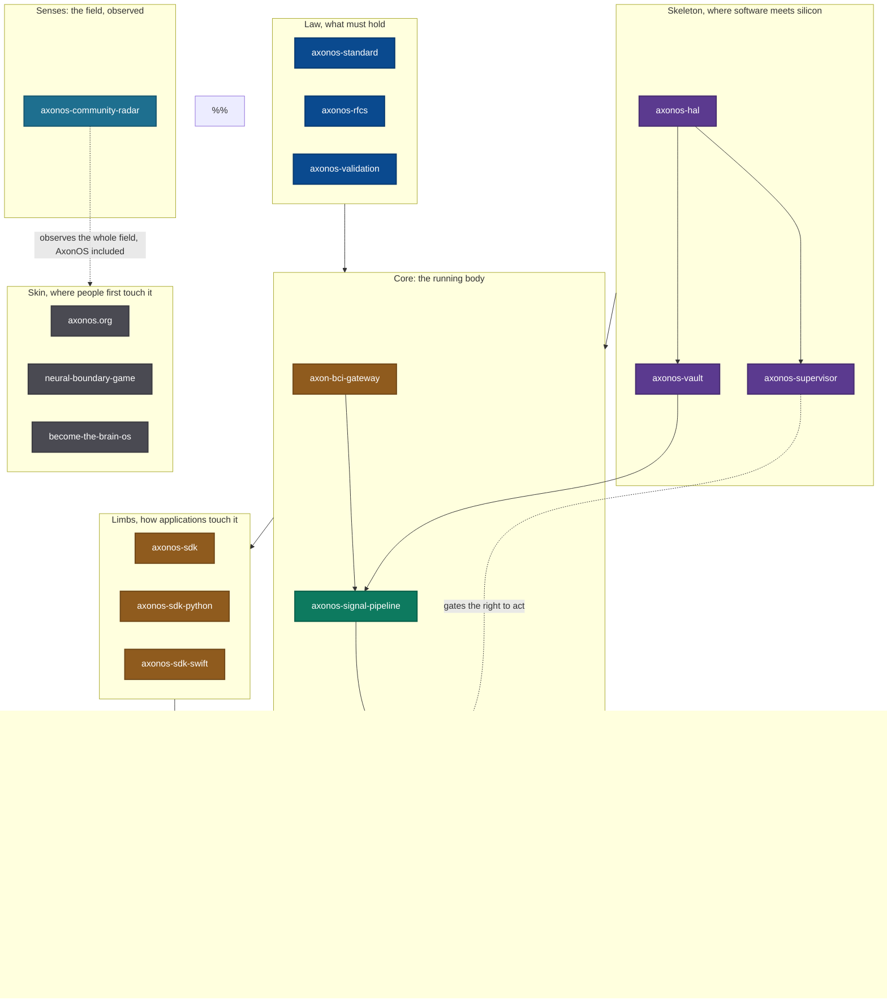

[](/AxonOS-org/.github/blob/main/profile/banner.jpg)

# AxonOS

### The open cognitive operating system for brain–computer interfaces.

[English](https://github.com/AxonOS-org/.github/blob/main/profile/README.md) · [日本語](https://github.com/AxonOS-org/.github/blob/main/profile/README.ja.md) · [中文](https://github.com/AxonOS-org/.github/blob/main/profile/README.zh.md) · [Italiano](https://github.com/AxonOS-org/.github/blob/main/profile/README.it.md) · [Français](https://github.com/AxonOS-org/.github/blob/main/profile/README.fr.md) · [Deutsch](https://github.com/AxonOS-org/.github/blob/main/profile/README.de.md) · [Español](https://github.com/AxonOS-org/.github/blob/main/profile/README.es.md) · [العربية](https://github.com/AxonOS-org/.github/blob/main/profile/README.ar.md)

[](https://github.com/AxonOS-org/axonos-standard/releases) [](https://github.com/AxonOS-org/axonos-kernel/releases) [](https://github.com/AxonOS-org/axonos-consent/releases) [](https://github.com/AxonOS-org/axonos-protocol/releases) [](https://www.rust-lang.org/) [](#licensing) [](https://model-checking.github.io/kani/) [](https://axonos-bci.github.io/axonos-community-radar/)

**[axonos.org](https://axonos.org)** · **[Specifications](https://axonos.org/specifications.html)** · **[SDK](https://axonos.org/sdk.html)** · **[Research](https://axonos.org/research.html)** · **[Articles](https://medium.com/@AxonOS)** · **<connect@axonos.org>**

---

## Read this page in five minutes

| If you are… | Start here |
|:--|:--|
| deciding whether this is real | [The numbers, and where each one comes from](#the-numbers-and-where-each-one-comes-from), every published figure, its evidence level, and the artefact it derives from |
| an engineer, sceptical | [If you wanted to prove this wrong](#if-you-wanted-to-prove-this-wrong), where to push, and what would falsify each claim |
| looking for the code | [Quick start](#quick-start) · [The stack](#the-stack) · [Architecture](#architecture) |
| wondering why it is built this way | [The constraints this is built against](#the-constraints-this-is-built-against): the physics and biology, not the preferences |
| checking whether we overclaim | [What AxonOS does not claim](#what-axonos-does-not-claim) · [What is genuinely unsolved](#what-is-genuinely-unsolved) |
| holding a vulnerability | **security@axonos.org**: a coordinated-disclosure window is offered and the finding is published either way. See [`SECURITY.md`](https://github.com/AxonOS-org/axonos-kernel/blob/main/SECURITY.md) in any repository |

**One command, ninety seconds, no account:**

```sh
git clone https://github.com/AxonOS-org/axonos-stack && cd axonos-stack
cargo run --locked --bin session -- --seed 7 --frames 3000 | diff - reference/session-7.txt
```

Silence means the whole chain, electrode to conditioning to privacy boundary to
the right to act, reproduced byte for byte on your machine. The session is not
a happy path: an electrode lifts partway through and the transcript records the
system withdrawing the right to actuate 96 ms later, while it keeps recording.

---

## Who is writing this

I am Denis Yermakou. I build AxonOS on my own, from Singapore.

There is no team. If you are thinking of depending on this, that is a risk and
you should know it from me rather than work it out later.

It also explains a few things you might otherwise find strange. The
specifications are unusually detailed because I have no colleague to remember
what we decided. Almost everything is machine-checked because I have no
reviewer. And this page keeps telling you how to prove me wrong because nobody
else is going to do it for me.

I read connect@axonos.org. If you find a mistake, an issue is more use to me
than a polite silence.

---

## What AxonOS is

AxonOS is a hard real-time neural operating system for brain–computer
interfaces. Open-source kernel in `#![no_std]` Rust on ARM Cortex-M.
Formally bounded worst-case response time. Structural privacy that the
application layer cannot bypass.

It is not an AI-agent framework, a chatbot runtime, a Python SDK or a token
project. What sits below the application layer is the timing guarantee, the
neural-permission model and the consent state machine. All three are
specified, openly licensed, and built so that someone else can check them.

> Applications should receive typed, consent-bound intent events —
> never unrestricted raw neural streams.

---

## The constraints this is built against

Not architecture, physics and biology. Every design decision downstream is
either forced by one of these or is arbitrary, and knowing which is which is the
difference between an engineering argument and a preference.

**A scalp electrode measures tens of microvolts through skin, bone and hair.**
The signal of interest sits under the electrode's own thermal noise for most of
its bandwidth, and the largest thing in the recording is usually not brain at
all. It is the mains, at fifty or sixty hertz, arriving through the body as an
antenna. This is why the pipeline notches before it does anything else, why the
front end runs at gain 24, and why an amplitude threshold is measured in ADC
counts rather than volts: the conversion needs a reference voltage and a gain
that belong to the acquisition hardware, and a DSP stage asserting them would be
claiming to know a board it cannot see.

**Cortical intent does not wait.** The window between a decision and its
expression is short enough that a control loop which misses it produces
something worse than no assistance. It produces an action the person has
already stopped intending. That is the entire reason a deadline here is a hard
one and not a target, and why an admission test that cannot refuse is not a
test.

**Electrodes drift, and the person moves.** Gel spreads, impedance falls for
twenty minutes and then rises, a jaw clench swamps every channel, and a
half-lifted electrode produces a signal that looks plausible and means nothing.
A system that assumes a stationary source is a system that will act confidently
on garbage in the fifth minute of use.

**Every subject's head is a different mixing matrix.** Skull thickness, gyral
folding and electrode placement combine into a linear mixture that is unique to
the person and the session. This is why cross-subject transfer is hard, and why
a claim of calibration-free decoding needs a stronger argument than a working
demo: the demo may simply have found two subjects whose mixtures were similar.

**A brain-computer interface reads intention.** Not a heart rate, not a step
count. The record is not sensitive because it is medical; it is sensitive
because it is *upstream of speech*. It can contain the thing a person decided
and did not say. That asymmetry is why the privacy boundary is not a feature
placed beside the others but a constraint the rest is built inside of.

---

## One organism


```mermaid
flowchart TB
    subgraph LAW["Law, what must hold"]
        STD[axonos-standard]
        RFC[axonos-rfcs]
        VALID[axonos-validation]
    end
    subgraph SKEL["Skeleton, where software meets silicon"]
        HAL[axonos-hal]
        VAULT[axonos-vault]
        SUP[axonos-supervisor]
    end
    subgraph CORE["Core: the running body"]
        GW[axon-bci-gateway] --> SP[axonos-signal-pipeline] --> K[axonos-kernel]
        K --> CO[axonos-consent] --> PR[axonos-protocol]
        SW[axonos-swarm] -.-> PR
    end
    subgraph LIMBS["Limbs, how applications touch it"]
        SDK[axonos-sdk]
        SDKP[axonos-sdk-python]
        SDKS[axonos-sdk-swift]
    end
    subgraph IMMUNE["Immune system, byte-drift is rejected"]
        CONF[axonos-conformance]
        E2E[axonos-e2e-demo]
    end
    subgraph SENSES["Senses: the field, observed"]
        RADAR[axonos-community-radar]
    end
    subgraph SKIN["Skin, where people first touch it"]
        SITE[axonos.org]
        NBG[neural-boundary-game]
        BTB[become-the-brain-os]
    end
    HAL --> VAULT --> SP
    HAL --> SUP
    SUP -. gates the right to act .-> K
    LAW --> CORE
    SKEL --> CORE
    CORE --> LIMBS
    LIMBS --> IMMUNE
    RADAR -. observes the whole field, AxonOS included .-> SKIN

    %% One hue per anatomical group, and every node gets one. A diagram where
    %% some groups are coloured and others sit at the default grey reads as
    %% unfinished: the eye takes grey for less important, not for unstyled.
    %%
    %% The core row is declared mid-line (GW --> SP --> K), so a check that
    %% looked for node declarations at the start of a line missed four of them
    %% and reported the diagram fully styled when it was not.
    classDef law    fill:#0a4a8f,stroke:#083a70,color:#fff,stroke-width:2px
    classDef skel   fill:#5b3a8f,stroke:#472d70,color:#fff,stroke-width:2px
    classDef core   fill:#0d7a5f,stroke:#0a5f4a,color:#fff,stroke-width:2px
    classDef limb   fill:#8f5b1e,stroke:#704818,color:#fff,stroke-width:2px
    classDef immune fill:#8f2d3a,stroke:#70232d,color:#fff,stroke-width:2px
    classDef sense  fill:#1e6f8f,stroke:#185870,color:#fff,stroke-width:2px
    classDef skin   fill:#4a4a52,stroke:#3a3a40,color:#fff,stroke-width:2px

    class STD,RFC,VALID law
    class HAL,VAULT,SUP skel
    class SDK,SDKP,SDKS,GW limb
    class CONF,SW immune
    class SP,K,CO,PR core
    class RADAR sense
    class SITE,BTB,NBG,E2E skin
```

<details>
<summary>what each organ refuses to do, and why that matters more than what it does</summary>

The repositories are not a list. They are organs of one body, and each one
exists because the body needs that function:


The skeleton is where the body meets the world: the HAL guarantees a sample is
real, the vault guarantees it stays, and the supervisor decides whether anything
may be acted on. The law constrains the core; SDK limbs give applications a
typed grip on it;
the conformance immune system rejects byte-drift across five languages before
it spreads; the [radar](https://axonos-bci.github.io/axonos-community-radar/)
is the organism's senses: a living, scored map of the whole open-BCI field in
which AxonOS ranks by the same formula as everyone else; the games and the
site are the skin where people first touch it. Remove any organ and something
specific stops working.

</details>

---

## The full path: electrode to intent

<details>
<summary>every stage a signal passes, with the arithmetic</summary>

A complete brain–computer interface operating system is a continuous chain, from
a raw electrode signal to a typed, consented intent, and back to a safe failure
state. AxonOS is building that chain in the open. This map is deliberately honest
about what is shipped, what is partial, and what is still ahead.

| Stage                                          | Provided by                                      | Status                         |
| ---------------------------------------------- | ------------------------------------------------ | ------------------------------ |
| Electrode acquisition contract                 | `axonos-hal`                                     | live                           |
| Electrode acquisition / ADC bridge             | `axon-bci-gateway` (OpenBCI)                     | **partial**                    |
| Privacy boundary on raw neural data            | `axonos-vault`                                   | live                           |
| Signal-quality posture / right to act          | `axonos-supervisor`                              | live                           |
| Monotonic timestamping                         | `axonos-kernel`                                  | **live**                       |
| Deterministic handoff. SPSC IPC, ring buffers | `axonos-kernel`                                  | **live**                       |
| Signal conditioning, fixed-point IIR bank (DC blocker · notch · band-pass) | [`axonos-signal-pipeline`](https://github.com/AxonOS-org/axonos-signal-pipeline) | **live** *(machinery, vector-pinned)* |
| Feature extraction & classifier inference (MDM / LDA) | [`axonos-signal-pipeline`](https://github.com/AxonOS-org/axonos-signal-pipeline) | **live** *(no trained model yet)* |
| Typed intent ABI. RFC-0006                    | `axonos-sdk`, `axonos-sdk-python`                | **live**                       |
| Byte-exact conformance                         | `axonos-conformance`                             | **live**                       |
| Consent & capability gate. RFC-0005           | `axonos-consent`, `axonos-protocol`, kernel gate | **live**                       |
| Application boundary                           | `axonos-sdk`                                     | **live**                       |
| Audit & reproducible traces                    | `axonos-validation`                              | **live** *(L2 traces pending)* |
| Safe failure state                             | `axonos-kernel`                                  | **live**                       |

### What a complete BCI OS still needs

The execution core, the consent and capability layer, and the conformance surface
are in place. To be a full operating system, not only a standard and a kernel —
AxonOS still needs, and is sequencing on its roadmap:

**Closed since this list was written:**

- the **acquisition contract** — [`axonos-hal`](https://github.com/AxonOS-org/axonos-hal)
  defines what a sample is, what time the chain may take, and what happens when
  the hardware misbehaves. *Half of an item:* the contract and a simulated
  backend exist; a register-level ADS1299 driver does not, and the OpenBCI
  bridge above is still the only path to physical silicon;
- the **deterministic simulator running the full path without hardware** —
  [`axonos-stack`](https://github.com/AxonOS-org/axonos-stack) wires the organs
  into one seeded session whose transcript is byte-exact and diffed in CI;
- the **privacy-vault enforcement layer** —
  [`axonos-vault`](https://github.com/AxonOS-org/axonos-vault) makes raw samples
  unreadable by construction and meters every reduction that leaves against a
  declared information budget, because a permission answered per request is
  defeated by asking many times.

**Still needed, and sequenced on the roadmap:**

- a **trained model and measured accuracy / latency / power** for the fixed-point DSP and classifier machinery already shipped in [`axonos-signal-pipeline`](https://github.com/AxonOS-org/axonos-signal-pipeline): the pipeline is implemented and vector-pinned; what is pending is a trained model and on-hardware numbers;
- **secure boot, firmware attestation and signed update**: the canonical hardware carries an ATECC608B secure element that no software in this organisation currently uses. For a device that reads a brain, unauthenticated firmware is the largest single hole in the design;
- **power and energy management**, and, specifically, its interaction with the timing proofs: a frequency or sleep-state transition changes worst-case execution time, so `axonos-hal`'s budget must be re-closed at every transition rather than assumed across it;
- a structured **safety case** (hazard analysis, FMEA, residual-risk argument) and a formal **threat model** for cognitive data, as engineering artifacts, not regulatory claims;
- a public **conformance program** and an **independent-implementer challenge**: the real test of a standard is whether a stranger can build a byte-compatible kernel and SDK from [`axonos-standard`](https://github.com/AxonOS-org/axonos-standard) and the RFCs *alone*, with no access to this source, and pass [`axonos-conformance`](https://github.com/AxonOS-org/axonos-conformance) unchanged. That is the bar AxonOS is building toward;
- a path from founder-led to **foundation / technical-steering** governance.

These are roadmap items, not present capabilities. They are published here so the
distance between today's reference implementation and a complete, independently
implementable BCI operating system is **visible rather than hidden**.

</details>

---

## The stack

Source under Apache-2.0 OR MIT, specifications under CC-BY-SA-4.0. Every
repository below is public and has one role. One component in the wider
ecosystem is private by design: the scoring engine behind the community
radar; its inputs, outputs, methodology and that boundary are stated openly
[on the radar itself](https://axonos-bci.github.io/axonos-community-radar/).

|   | Repository                                                                     | Role                                                                                                                                              | Language | Latest                                                                                                                                       |
| --- | ------------------------------------------------------------------------------ | ----------------------------------------------------------------------------------------------------------------------------------------------- | -------- | ------------------------------------------------------------------------------------------------------------------------------------------ |
| ⬢ | [**`axonos-standard`**](https://github.com/AxonOS-org/axonos-standard)         | Normative architecture: the canonical technical standard                                                                                         | Markdown | [](https://github.com/AxonOS-org/axonos-standard/releases) |
| ⬢ | [**`axonos-rfcs`**](https://github.com/AxonOS-org/axonos-rfcs)                 | Design-change process, numbered engineering RFCs, normative once finalised                                                                       | Markdown | active                                                                                                                                       |
| ⬢ | [**`axonos-kernel`**](https://github.com/AxonOS-org/axonos-kernel)             | Execution substrate, hard real-time microkernel, formally bounded WCRT                                                                           | Rust     | [](https://github.com/AxonOS-org/axonos-kernel/releases) |
| ⬢ | [**`axonos-sdk`**](https://github.com/AxonOS-org/axonos-sdk)                   | Application boundary, typed intents, capability manifests, kernel ABI v1                                                                         | Rust     | [](https://github.com/AxonOS-org/axonos-sdk/releases) |
| ⬢ | [**`axonos-sdk-python`**](https://github.com/AxonOS-org/axonos-sdk-python)     | Application boundary (Python). RFC-0006 wire format, byte-compatible with the Rust SDK                                                           | Python   | [](https://github.com/AxonOS-org/axonos-sdk-python/releases) |
| ⬢ | [**`axonos-sdk-swift`**](https://github.com/AxonOS-org/axonos-sdk-swift)       | Application boundary (Swift), typed neural intent streams, ABI v1, async/await + Combine                                                        | Swift    | active                                                                                                                                       |
| ⬢ | [**`axonos-hal`**](https://github.com/AxonOS-org/axonos-hal)                     | The contract with silicon, sample frames, a timing budget that refuses configurations whose deadline the measured chain cannot meet, explicit degradation semantics; `no_std`, zero-alloc | Rust     | [](https://github.com/AxonOS-org/axonos-hal/releases) |
| ⬢ | [**`axonos-vault`**](https://github.com/AxonOS-org/axonos-vault)                 | The privacy boundary, raw samples are unreadable by construction; only bounded, purpose-bound, budgeted reductions leave, and every one is recorded | Rust     | [](https://github.com/AxonOS-org/axonos-vault/releases) |
| ⬢ | [**`axonos-supervisor`**](https://github.com/AxonOS-org/axonos-supervisor)       | The right to act, signal-quality posture gating actuation, never acquisition; degradation immediate, recovery earned, `Safe` terminal until a human resets | Rust     | [](https://github.com/AxonOS-org/axonos-supervisor/releases) |
| ⬢ | [**`axonos-stack`**](https://github.com/AxonOS-org/axonos-stack)                 | The reference session: the three organs above wired together, deterministic from a seed, with a byte-exact transcript diffed in CI | Rust     | [](https://github.com/AxonOS-org/axonos-stack/releases) |
| ⬢ | [**`axonos-consent`**](https://github.com/AxonOS-org/axonos-consent)           | Consent / co-authorisation subsystem — `#![no_std]` reference crate                                                                               | Rust     | [](https://github.com/AxonOS-org/axonos-consent/releases) |
| ⬢ | [**`axonos-protocol`**](https://github.com/AxonOS-org/axonos-protocol)         | Network-level consent protocol — `no_std`, zero-alloc, bounded CBOR frames and an exhaustive consent state machine                                | Rust     | [](https://github.com/AxonOS-org/axonos-protocol/releases) |
| ⬢ | [**`axonos-conformance`**](https://github.com/AxonOS-org/axonos-conformance)   | Byte-exact conformance. RFC-0005 capability manifest & RFC-0006 intent wire format, cross-checked across Rust, Python, C, JavaScript, Java in CI | multi    | active                                                                                                                                       |
| ⬢ | [**`axonos-signal-pipeline`**](https://github.com/AxonOS-org/axonos-signal-pipeline) | Signal pipeline, fixed-point DSP filter bank, features, MDM/LDA classifier inference, calibration; vector-pinned, no trained model | Rust | [](https://github.com/AxonOS-org/axonos-signal-pipeline/releases) |
| ⬢ | [**`axonos-e2e-demo`**](https://github.com/AxonOS-org/axonos-e2e-demo) | End-to-end reference, synthetic signal -> typed consent-bound intent, verified bit-for-bit on every run | Python | active |
| ⬢ | [**`axonos-validation`**](https://github.com/AxonOS-org/axonos-validation)     | Evidence and trace record, measurement traces and reference post-processing                                                                      | Python   | record                                                                                                                                       |
| ⬢ | [**`axon-bci-gateway`**](https://github.com/AxonOS-org/axon-bci-gateway)       | Acquisition bridge. OpenBCI fork, MIT preserved from upstream                                                                                    | HTML     | [](https://github.com/AxonOS-org/axon-bci-gateway/releases) |
| ⬢ | [**`axonos-swarm`**](https://github.com/AxonOS-org/axonos-swarm)               | Long-horizon distributed timing, multi-node Neural PTP coordination                                                                              | Rust     | [](https://github.com/AxonOS-org/axonos-swarm/releases) |
| ⬢ | [**`AxonOS`**](https://github.com/AxonOS-org/AxonOS)                           | Public entry point, landing, concept, and links into the stack                                                                                   | —        | —                                                                                                                                           |
| ⬢ | [**`become-the-brain-os`**](https://github.com/AxonOS-org/become-the-brain-os) | Community front door, browser game that teaches the runtime, no install                                                                          | HTML/JS  | [](https://github.com/AxonOS-org/become-the-brain-os/releases) |
| ⬢ | [**`neural-boundary-game`**](https://github.com/AxonOS-BCI/neural-boundary-game) | Interactive demo, deterministic Rust/WASM model of the sovereignty architecture (consent, least-privilege scopes, sealed vault, StimGuard), playable in-browser, byte-for-byte replayable | Rust/WASM | [](https://github.com/AxonOS-BCI/neural-boundary-game/releases) |
| ⬢ | [**`axonos-community-radar`**](https://github.com/AxonOS-BCI/axonos-community-radar) | The organism's senses: a living, scored map of the open-BCI field (120 projects, refreshed ~3 h); AxonOS ranked by the same formula as everyone else | Python/JS | [](https://github.com/AxonOS-BCI/axonos-community-radar/releases) |

> `neural-boundary-game` and `axonos-community-radar` live in the
> **AxonOS-BCI** account. The game ships under **AGPL-3.0-only OR AxonOS
> Commercial**. It is the application-layer demo, not part of the permissive
> Apache/MIT core.

---

## Architecture

<details>
<summary>layer diagram</summary>


```mermaid
flowchart LR
    A[EEG/EMG sensors<br/>ADS1299 · 24-bit] -->|raw| B[Acquisition gateway<br/>nRF52840]
    B -->|filtered| C[AxonOS kernel<br/>Rust no_std<br/>Cortex-M4F]
    C -->|WCRT ≤ 1 ms, proven L1| D[Cognitive scheduler]
    D -->|typed intent| E[Application<br/>via SDK]
    F[Cognitive Hypervisor<br/>TrustZone-S] -.->|isolates| C
    G[Consent FSM<br/>axonos-consent] -.->|gates| D

    %% Grey is deliberate here, unlike in the organ diagram above. Colour marks
    %% what AxonOS owns; the sensors, the gateway and the applications are
    %% somebody else's and are left plain on purpose. Filling every node would
    %% delete the only thing this diagram says.
    classDef kernel fill:#0a4a8f,stroke:#083a70,color:#fff,stroke-width:2px
    classDef secure fill:#0d7a5f,stroke:#0a5f4a,color:#fff,stroke-width:2px
    class C kernel
    class F,G secure
```

Every arrow is a contract. The [Standard](https://github.com/AxonOS-org/axonos-standard) defines what must hold at each boundary; an implementation is free in
everything else.

</details>

---

## Quick start

```sh
git clone https://github.com/AxonOS-org/axonos-sdk
cd axonos-sdk
cargo test --features std
```

```rust
use axonos_sdk::{Capability, IntentStream, Manifest};

let manifest = Manifest::builder()
    .app_id("com.example.cursor")?
    .capability(Capability::Navigation)
    .max_rate_hz(50)
    .build()?;

let mut stream = IntentStream::connect(&manifest)?;
while let Some(obs) = stream.try_next()? {
    println!("{:?} @ {} µs ({}%)",
        obs.kind(),
        obs.timestamp().as_micros(),
        obs.confidence_percent());
}
```

The SDK is the Rust reference binding. C FFI, Python, WebAssembly, JNI,
and Swift bindings are on the [published roadmap](https://axonos.org/sdk.html).

---

## See it work, and verify it yourself

<details>
<summary>six commands, and what each one proves</summary>

Nothing here asks for trust. Every claim is runnable in **one click** or **three commands**, and each prints a pass/fail you can check.

**One click**

- ▶ **Play it** — [**Neural Boundary Game**](https://axonos.org/neural-boundary-game.html): the consent, least-privilege, sealed-vault and StimGuard model, live in the browser on the same deterministic core the kernel uses. Every run emits a byte-for-byte replayable proof.
- **Read the analysis** — [**Zenodo preprint**](https://doi.org/10.5281/zenodo.20552007) (DOI `10.5281/zenodo.20552007`): EDF schedulability (R1 = 972 µs inside a 4 ms deadline), capability isolation, falsifiable predictions — *predicted from datasheet cycle counts, no measurement claims*.

**Three commands**, clone and run; each is reproducible on any machine

```sh
# 1 · the full path, electrode -> typed intent, verified bit-for-bit
git clone https://github.com/AxonOS-org/axonos-e2e-demo && cd axonos-e2e-demo && ./run.sh --verify

# 2 · the kernel: 72 tests, then a machine-checked proof
git clone https://github.com/AxonOS-org/axonos-kernel && cd axonos-kernel
cargo test --workspace
cargo kani setup && ( cd axonos-spsc/kani-proofs && cargo kani )

# 3 · the DSP + classifier machinery, bit-exact against conformance vectors
git clone https://github.com/AxonOS-org/axonos-signal-pipeline && cd axonos-signal-pipeline && cargo test
```

**Three more, added as the stack grew**, each answers a different kind of doubt

```sh
# 4 · the organs running as one body: electrode -> vault -> posture, from a seed
git clone https://github.com/AxonOS-org/axonos-stack && cd axonos-stack
cargo run --locked --bin session -- --seed 7 --frames 3000 | diff - reference/session-7.txt
# silence means the transcript reproduced byte for byte on your machine

# 5 · the relevance score behind the public map, recomputed from its own evidence
git clone https://github.com/AxonOS-org/axonos-brs && cd axonos-brs && cargo test
# 20 vectors are real projects with their published evidence and pinned scores

# 6 · who wrote the automated commits on the live map, and whether GitHub signed them
gh api repos/AxonOS-BCI/axonos-community-radar/commits \
  --jq '.[0:10][] | "\(.commit.verification.verified)  \(.author.login)"'
```

The fourth is the one worth dwelling on. The reference session is not a demo of
a happy path: the simulated front end lifts an electrode at 4.8 s, and the
transcript records the system withdrawing the right to actuate 96 ms later while
continuing to record. The last line is an accounting identity — *delivered +
lost = produced*, and if it ever fails, one of the three components is lying
about what it saw. CI diffs that transcript on every push, so a dependency that
changes observable behaviour fails the build with a diff of exactly what moved.

One wire format, **five languages, byte-identical** — [`axonos-conformance`](https://github.com/AxonOS-org/axonos-conformance) re-checks Rust = Python = C = JavaScript = Java in CI on every push.

> What you are checking: the proofs are machine-checked (**L1**); the demos are deterministic and reproducible; the on-hardware worst-case numbers (**L2**) are **not yet claimed**, their status is tracked, claim by claim, in [`CLAIMS.md`](https://github.com/AxonOS-org/axonos-standard/blob/main/CLAIMS.md).

</details>

---

## The numbers, and where each one comes from

Every quantitative figure this organisation publishes, its evidence level, and
the artefact it derives from. **L1** is formally proven, **L2** measured on
reference hardware, **L3** independently reproduced. A figure absent from this
table is a figure we do not publish.

| Figure | Value | Level | Derived from |
|:--|--:|:--:|:--|
| End-to-end WCRT, proven upper bound | ≤ 1000 µs | **L1** | [`axonos-scheduler` BMC harnesses](https://github.com/AxonOS-org/axonos-kernel/blob/main/axonos-scheduler/kani-proofs/src/main.rs) |
| End-to-end WCRT, worst observed | 972 µs | L2 | RFC-0001 · 12 h, 10.8 M epochs, 0 misses, STM32F407 — *raw trace publication pending* |
| Admitted task set, Σ Cᵢ | 694.2 µs | L2 | RFC-0001 · four tasks, each published separately |
| Blocking + interference residual | 277.8 µs | L2, inferred | the difference of the two rows above, less jitter — [RFC-0008 §4a](https://github.com/AxonOS-org/axonos-rfcs/blob/main/rfcs/0008-deadline-closure-acquisition-chain.md) |
| IPC slot latency, proven upper bound | ≤ 0.5 µs | **L1** | [`axonos-spsc` BMC harnesses](https://github.com/AxonOS-org/axonos-kernel/blob/main/axonos-spsc/kani-proofs/src/main.rs) |
| Consent withdrawal, proven upper bound | ≤ 1648 cycles *(≈ 9.8 µs @ 168 MHz)* | **L1** | [`handle_withdraw_terminates.rs`](https://github.com/AxonOS-org/axonos-consent/blob/main/kani/handle_withdraw_terminates.rs) |
| Release jitter, σ | 2.1 µs | L2 | RFC-0001 — *trace publication pending* |
| Release jitter, P99.9 | 6.5 µs | L2 | RFC-0001 — *trace publication pending* |
| Utilisation ceiling | 0.25 | policy | RFC-0001 · the admitted set runs at 0.174 |
| Jitter-limited SNR at 100 Hz | 57.6 dB | **L1** | −20·log₁₀(2π·f·σ), arithmetic over the σ above |
| Goertzel coefficient accuracy | 1 count in ≈ 31 700 | **L1** | tested against the closed form in `axonos-signal-pipeline` |
| Alignment residual is orthogonal | to 1e-8 | **L1** | numeric check of the polar decomposition |
| Kani BMC harnesses | 36 *(kernel 30 · consent 6)* | **L1** | re-proved at every [release gate](https://github.com/AxonOS-org/axonos-kernel/blob/main/.github/workflows/release-gate.yml) |
| Audited `unsafe` operations, kernel | 2 | **L1** | `#![forbid(unsafe_code)]` across consent, protocol and five kernel crates |
| Conformance languages, byte-identical | 5 | **L1** | re-checked on every push |
| Projects on the live map | ~120 | measured, live | [`data/radar.json`](https://github.com/AxonOS-BCI/axonos-community-radar/blob/main/data/radar.json), refreshed every 3 h. The near misses and the funnel behind them are published at the [map](https://axonos-bci.github.io/axonos-community-radar/) |
| Repositories scanned per run | ~3 200 | measured, live | [`data/last_run.json`](https://github.com/AxonOS-BCI/axonos-community-radar/blob/main/data/last_run.json): the exact figure moves every scan, so the table gives the order and links the number |
| Long-form architecture articles | 42+ | — | [on Medium](https://medium.com/@AxonOS) |

The distinction in the first two rows is the one that matters and the one most
often collapsed. **≤ 1000 µs is proven**; 972 µs is the worst thing anyone has
*seen*. A proof and an observation are different kinds of statement, and until
the raw traces land in
[`axonos-validation`](https://github.com/AxonOS-org/axonos-validation) **no
measured performance figure is claimed here**: the L2 rows are held as
publication-pending and graded in
[`CLAIMS.md`](https://github.com/AxonOS-org/axonos-standard/blob/main/CLAIMS.md).
**L3 independent reproduction is not claimed for anything.**

**Not in this table, and therefore not claimed:** classification accuracy,
information transfer rate, power draw, on-hardware end-to-end latency in a
deployment, session length, electrode count in real use.

---

## What the checks actually caught

<details>
<summary>four defects found this month, each with its measurement</summary>

A verification story is only worth reading if it has failures in it. These are
this month's, with the measurement that produced each. They are here because a
project that publishes only its successes has put its failures somewhere else.

**A timing assumption refuted by our own published data.** The admission test
for the real-time chain omitted blocking and interference: a normal
simplification, and here a wrong one. RFC-0001 publishes two figures measured on
the same board: the admitted task set sums to **694.2 µs**, and the end-to-end
worst case is **972 µs**. The **277.8 µs** between them — 28.6 % of the budget,
of which at most 6.5 µs is jitter, is precisely the terms the test was leaving
out. The assumption was not merely undischarged; it was contradicted by our own
measurement, and nobody had subtracted the two numbers.
[RFC-0008 §4a](https://github.com/AxonOS-org/axonos-rfcs/blob/main/rfcs/0008-deadline-closure-acquisition-chain.md)

**A score that could not rank.** The public map's relevance score is displayed
on every card and decides what is on the map at all. Measured across 117 scored
projects it took **nine distinct values**: 19 % sat at exactly 100 and 31 % at
exactly the inclusion gate. It was a category label wearing a number. Replacing
the combiner, saturating instead of summing and clamping, produced **35**
distinct values with the ceiling empty and the gate unchanged.
[`axonos-brs`](https://github.com/AxonOS-org/axonos-brs)

**Two bounds that disagreed, found only by running the parts together.** The
privacy vault issues grants denominated in bits; its audit log holds 64 entries;
and it refuses to release anything it cannot record. A 3 200-bit grant was
therefore capped at 2 048, so the number written in the grant was not the one
that stopped it and no reader could tell. Both behaviours were individually
correct and individually tested. Only the integration session surfaced the
disagreement. That is the argument for having one.
[RFC-0009 §N5](https://github.com/AxonOS-org/axonos-rfcs/blob/main/rfcs/0009-bounded-disclosure-sealed-neural-data.md)

**An unpaid side channel in a boundary that exists to have none.** The same
vault refused a request when its window was empty: a refusal that depends on
the *data* rather than on the caller's permissions, so a caller could ask "is
this device recording?" for free and without limit, outside the information
budget entirely. Now the probe is charged: a thousand attempts against a 128-bit
grant yield four answers and then a refusal.

Each of these is written up where it belongs, with the deviation recorded
against the specification that names it. Neither RFC-0008 nor RFC-0009 may leave
draft status while its own conformance table still lists an unmet requirement.

</details>

---

## If you wanted to prove this wrong

<details>
<summary>where to attack, and what would falsify each claim</summary>

Most projects tell you what they claim. Almost none tell you where to push. The
list below is where a determined sceptic should look, what specifically would
falsify each claim, and, where the answer is already known, what has been
found. It is not a hedge; it is the shortest path to being right about us.

**The real-time guarantee.** The published worst case is 972 µs against a 4 ms
deadline. It rests on a task set of 694.2 µs plus 277.8 µs of terms measured but
not modelled, and on the assumption that the acquisition chain is the only work
on that core. *Falsified by:* an oscilloscope trace on an STM32F407 showing a
response beyond 4 ms under any load the design admits, or a demonstration that
the chain can be preempted by work the analysis does not count. The L3 fixture
that would settle this does not exist yet, and the RFC says so rather than
implying otherwise.

**The alignment result.** `R̄^{-1/2}(P G_c Pᵀ)R̄^{-1/2} = U G_c Uᵀ` with `U`
orthogonal, alignment reduces inter-subject difference to a rotation and cannot
remove it. *Falsified by:* a whitener satisfying `W R Wᵀ = I` that removes the
residual rotation, which would contradict the polar decomposition, or an
arithmetic error in the derivation. Verified numerically to 1e-7 on random SPD
inputs; the algebra is three lines and is written out in full.

**The information bound.** For a grant of β bits, the mutual information between
the sealed window and everything an application learns is at most β. *Falsified
by:* a channel that carries information across the boundary without being
charged. One such channel was found and closed: a refusal that depended on the
window let a caller poll device liveness for free, and RFC-0009 §7 enumerates
the remaining ones it knows about. If you find another, that section is wrong
and should say so.

**The determinism.** Same seed, same bytes, any machine. *Falsified by:* one run
of `cargo run --locked --bin session -- --seed 7 --frames 3000` on your hardware
that does not `diff` clean against the checked-in transcript. This is the
cheapest attack on the list and the one we would most want to hear about.

**Cross-language agreement.** One wire format decoded identically in Rust,
Python, C, JavaScript and Java. *Falsified by:* an input on which any two
implementations disagree by a byte. The vectors are public; the disagreement
would be a bug report we could not argue with.

**What is not claimed, so cannot be falsified here.** No accuracy figure. No
transfer property. No latency or power measured on hardware. No clinical claim
of any kind. If you find any of those asserted anywhere in these repositories,
that is a defect and we want the issue.

</details>

---

## What is genuinely unsolved

<details>
<summary>five problems nobody has solved, including us</summary>

Written down because the honest version of a roadmap includes the parts nobody
knows how to do, and because a project that lists only tractable work is
describing a product and not a field.

**Calibration-free decoding across subjects.** Alignment reduces the difference
between two people's recordings to a residual rotation and provably cannot
remove it. Whether that rotation is benign depends on the montage, and nobody
has a general answer: the successful reports come from fixed layouts where the
mixing matrices were already similar. An implementation cannot settle this; only
recordings can.

**Worst-case execution time on a modern core.** Caches, branch prediction and
memory controllers make a tight upper bound either unattainable or so
conservative it wastes most of the machine. Every hard-real-time system on such
hardware is trading one of those away, and saying which is the honest part.

**Long-session non-stationarity.** Signal statistics drift over an hour in ways
that are not a simple function of anything observable at the electrode. Online
adaptation tracks the drift it can see; the part it cannot see is why decoders
degrade over a session and why a fresh calibration still helps after one.

**Enforcing consent at the point of use.** A revocation is enforceable on the
device that holds the data. Once a reduction has left, the guarantee becomes a
legal one and not a technical one, and no protocol yet makes an already
transmitted value unusable on request. Bounding what leaves is a partial answer,
and it is stated as partial.

**Establishing that a signal is voluntary.** A decoder reports what it detects.
Whether the person meant it, whether it was intent and not a reflex, a
startle, or the residue of a previous instruction, is not visible in the
signal, and the difference matters most in exactly the cases where a device is
most useful.

</details>

---

## What AxonOS does not claim

AxonOS does not currently claim, and this organisation must not be read
as claiming:

- FDA clearance, CE marking, or medical-device approval in any jurisdiction;
- clinical efficacy, or independent clinical validation;
- certified medical-device status, or production-implant readiness;
- complete compliance with IEC 62304, ISO 14971, or ISO 13485.

These are possible future milestones. They are not present facts, and the
project records them as such.

---

## Status

Dates appear here only where the work is inside this project's control.
Everything else carries the condition that releases it: a date invented to
fill a column expires, and an expired date left standing says more about a
project than an honest "blocked on X" ever did. RFC-0003 requires this of every
pending claim in the specifications; the front page is held to the same rule.

| Phase | What | State |
|:--|:--|:--|
| **Phase 0** | Architecture, RFCs, SDK surface, kernel verification harnesses, the reference organ stack | **complete and published** |
| **Phase 1** | On-hardware L2 traces published in [`axonos-validation`](https://github.com/AxonOS-org/axonos-validation) | **blocked**: requires an instrumented evaluation-board fixture, not yet procured. The `traces/` directory is empty and its emptiness is the honest counterpart of every "publication pending" row in the numbers table |
| **Phase 1** | Clinical-grade 8-channel development kit · ALS centre pilot | in progress |
| **Phase 2** | Structured safety case (hazard analysis, FMEA, residual-risk argument) | **not started**; it is a prerequisite for anything regulatory and is named as one rather than assumed |
| **Phase 2** | Regulatory engagement · standards-body contribution | **conditional** on the safety case and the L2 traces above. No date, because the condition is not ours to schedule |
| **Phase 3** | Independent implementer passes [`axonos-conformance`](https://github.com/AxonOS-org/axonos-conformance) from the specifications alone | **the real bar**, and open to anyone, see the standing [challenge](https://github.com/AxonOS-org/axonos-conformance/blob/main/CHALLENGE.md) |

**What "complete" means here.** Phase 0 is complete in the sense that the
artefacts exist, are versioned, are licensed, and are re-verified on every push.
It does not mean the system has been run on a person, and nothing on this page
should be read as saying otherwise.

---

## The open BCI field, live

<!-- RADAR:START -->
The **AxonOS Community Radar** continuously maps every open-source brain–computer-interface
project, tool and team building in the open — AxonOS included, ranked by the same public-signal
formula as everyone else, with no boosting.

<p align="center"><a href="https://axonos-bci.github.io/axonos-community-radar/report.html"><b>The State of Open BCI — read the full report →</b></a></p>

<p align="center">     </p>

<sub>One click for the exhaustive view — a Gartner-style reach×engagement quadrant, category and evidence breakdowns, and a full table of all 120 tracked resources. Currently leading by reach: `omi` · `wukong-robot` · `mne-python` · `NeuroKit`. Auto-refreshed from the radar every 3 hours · last update <b>07 Aug 2026, 10:33 UTC</b>.</sub>
<!-- RADAR:END -->

---

## The four commitments

|       | Commitment                               | What it means in practice                                                                                                              |
| ----- | ---------------------------------------- | -------------------------------------------------------------------------------------------------------------------------------------- |
| **1** | **Hard real-time on commodity hardware** | `#![no_std]` Rust on ARMv8-M. No GC, no allocator on the hot path, no unbounded panics. Memory safety is structural.                   |
| **2** | **Formally bounded WCRT**                | Every critical-path operation has a Kani-verified upper bound. Latency is *proven*, not benchmarked.                                   |
| **3** | **Structural privacy**                   | Capabilities that would leak raw cognitive state (`RawEEG`, `EmotionState`, `CognitiveProfile`) do not exist as types.                 |
| **4** | **Open ecosystem**                       | Apache-2.0 OR MIT for code, CC-BY-SA-4.0 for specifications. Every repository is public. Anyone can audit, fork, or replace any layer. |

---

The consent layer's proof files read like the promises they keep — [`fsm_no_invalid_transitions.rs`](https://github.com/AxonOS-org/axonos-consent/blob/main/kani/fsm_no_invalid_transitions.rs) · [`handle_withdraw_terminates.rs`](https://github.com/AxonOS-org/axonos-consent/blob/main/kani/handle_withdraw_terminates.rs) · [`co_authorisation_requires_two_parties.rs`](https://github.com/AxonOS-org/axonos-consent/blob/main/kani/co_authorisation_requires_two_parties.rs) · [`signature_verification_constant_time.rs`](https://github.com/AxonOS-org/axonos-consent/blob/main/kani/signature_verification_constant_time.rs) · [`cbor_decoder_bounded.rs`](https://github.com/AxonOS-org/axonos-consent/blob/main/kani/cbor_decoder_bounded.rs), five machine-checked Kani harnesses; the kernel's thirty are re-proved at every [release gate](https://github.com/AxonOS-org/axonos-kernel/blob/main/.github/workflows/release-gate.yml).

---

## Where to begin

Three honest paths, depending on what you want.

|       | If you want to …                    | Start here                                                                                                                                                        |
| ----- | ----------------------------------- | ----------------------------------------------------------------------------------------------------------------------------------------------------------------- |
| **A** | Get the idea in two minutes         | [Concept](https://axonos.org) · [**Play the Neural Boundary Game**](https://axonos.org/neural-boundary-game.html) · [3-page engineering memo](https://axonos.org/memo.html) |
| **B** | Read the engineering before judging | [`axonos-standard/STANDARD.md`](https://github.com/AxonOS-org/axonos-standard/blob/main/STANDARD.md) · [`axonos-rfcs`](https://github.com/AxonOS-org/axonos-rfcs) |
| **C** | Build against the substrate         | [`axonos-sdk`](https://github.com/AxonOS-org/axonos-sdk) · [SDK overview](https://axonos.org/sdk.html)                                                            |

---

## Documentation

<details>
<summary>specifications, RFCs, threat model</summary>

- [**Specifications**](https://axonos.org/specifications.html), kernel ABI v1, capability catalogue, `IntentObservation` wire format, RFC index
- [**SDK and language bindings**](https://axonos.org/sdk.html). Rust today; C FFI, Python, WebAssembly, JNI, Swift on the published roadmap
- [**Standards engagement**](https://axonos.org/standards.html). IEEE P2731 · IEC 62304 · ISO 13485 · FDA 510(k) · EU MDR
- [**Governance**](https://axonos.org/governance.html), current state, transition plan, trademark policy
- [**Engineering memo**](https://axonos.org/memo.html), three-page summary for technical readers
- [**Preprint**](https://doi.org/10.5281/zenodo.20552007) — *An Analytical Microkernel Design for Safety-Critical Brain–Computer Interfaces: Schedulability, Capability Isolation, and Falsifiable Predictions* (Zenodo, DOI `10.5281/zenodo.20552007`, CC-BY-4.0), analytical schedulability (R1 = 972 µs in a 4 ms deadline), capability isolation, falsifiable predictions P1–P5; no measurement claims
- [**Long-form articles**](https://medium.com/@AxonOS) — 42+ pieces, one per major architectural decision

</details>

---

## Contributing

<details>
<summary>how to open an issue that gets acted on</summary>

| Path                      | Where                                                                                              |
| ------------------------- | -------------------------------------------------------------------------------------------------- |
| Bugs and feature requests | the relevant repository's Issues tab                                                               |
| Specification proposals   | pull request to [`axonos-rfcs`](https://github.com/AxonOS-org/axonos-rfcs)                         |
| Code contributions        | [`axonos-sdk/CONTRIBUTING.md`](https://github.com/AxonOS-org/axonos-sdk/blob/main/CONTRIBUTING.md) |
| Security disclosures      | <security@axonos.org> · 90-day coordinated disclosure                                              |
| Clinical partnerships     | <connect@axonos.org>                                                                               |
| General correspondence    | <connect@axonos.org>                                                                               |

</details>

---

## Cite this work

<details>
<summary>BibTeX, CFF, DOI</summary>

AxonOS ships a [`CITATION.cff`](https://github.com/AxonOS-org/.github/blob/main/CITATION.cff),
so every repository in the organisation exposes a **"Cite this repository"**
button. For the peer-readable analysis, cite the preprint:

```bibtex
@article{axonos2026microkernel,
  title   = {An Analytical Microkernel Design for Safety-Critical
             Brain--Computer Interfaces: Schedulability, Capability
             Isolation, and Falsifiable Predictions},
  author  = {Yermakou, Denis},
  year    = {2026},
  doi     = {10.5281/zenodo.20552007},
  url     = {https://doi.org/10.5281/zenodo.20552007},
  note    = {Analytical bounds; predictions P1--P5; no measurement claims},
  license = {CC-BY-4.0}
}
```

The preprint is **analytical and falsifiable**. It states, up front, the
findings that would prove it wrong. If you reproduce or refute any bound, the
project wants to hear it: <connect@axonos.org>.

</details>

---

## Licensing

| Artefact                                  | License                                    |
| ----------------------------------------- | ------------------------------------------ |
| Kernel, SDK, consent, swarm, gateway      | Apache-2.0 OR MIT                          |
| RFCs and specifications                   | CC-BY-SA-4.0                               |
| `axon-bci-gateway`                        | MIT (preserved from upstream OpenBCI_GUI)  |
| `neural-boundary-game` (interactive demo) | AGPL-3.0-only OR AxonOS Commercial         |

---

[](/AxonOS-org/.github/blob/main/profile/logo.png)

**The AxonOS Project**

[axonos.org](https://axonos.org) · <connect@axonos.org> · [LinkedIn](https://www.linkedin.com/in/denis-yermakou) · [Medium](https://medium.com/@AxonOS)

Singapore · Zurich · Berlin · Milano · San Mateo

Built with Rust. Verified with Kani. Aimed at hard real-time.
